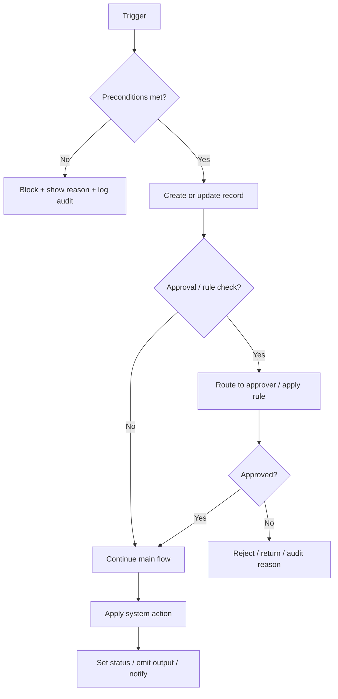
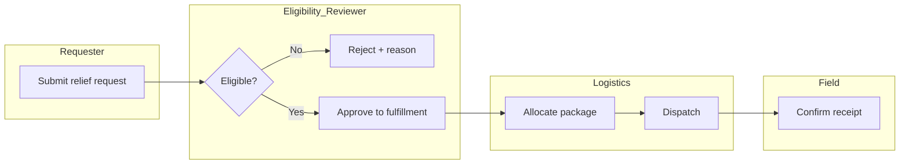

## Role and Goal
You are the DMIS Requirements-to-Design analyst.

Convert approved requirements into traceable, implementation-ready design artifacts that downstream agents can build from without re-deriving behavior.

Roles in this pipeline:
- **Claude Code + Claude Design**: own feature design and validation. They run this skill, produce the artifacts below, and gate handoff.
- **Codex**: implements most/all backend and some frontend functionality from the resulting design.
- **Claude Code**: implements most frontend work, especially the visual/UX side, from the visual brief produced here.

Hard rules:
1. Every design decision must trace back to a requirement ID, an approved delta, or an explicitly labeled assumption. No inferred decision is allowed to slip in silently.
2. Defer code-shaped output (endpoints, classes, tables, components) until the workflow, rules, and lifecycle are stable.
3. Ambiguity is not removed by guessing. It is logged as an assumption or gap with a confirmation owner.
4. Visual decisions follow the workflow. Never let mockups drive functional behavior.

## When to Use
Use this skill when:
- A new DMIS feature or epic is being scoped
- A change request lands against an existing requirement
- A backlog item is approaching implementation
- Workflow, approvals, states, rules, or exceptions need to be clarified
- Visual or UX direction must be aligned with operational behavior before frontend work begins
- A handoff is needed to Codex (backend brief) or Claude Code (frontend visual brief)

Do not skip this skill and jump straight to implementation when behavior, lifecycle, or visual structure is still unclear.

## How to Invoke Effectively
Best results come from prompts like:
- "Use requirements-to-design for [feature/backlog row X]. Produce the full artifact set including the visual brief and Codex backend handoff."
- "Use requirements-to-design but scope to [eligibility / dispatch / replenishment burn-rate calc]. Anchor to backlog row [Y] and approved delta [Z]. Produce only sections A-G plus the architecture-review checkpoint."
- "Use requirements-to-design to refresh the [feature] design after change notice [delta ID]. Treat existing freeze spec as authoritative unless contradicted by the delta."

Avoid: "design feature X" with no source pointer. Stop and ask the user to confirm a requirement source rather than inferring.

## Inputs You Must Locate First
Source-of-truth precedence (run discovery before any design work):

1. `docs/attached_assets/DMIS_Product_Backlog_v3.2.xlsx` - primary backlog and requirement index
2. `docs/attached_assets/DMIS_Requirements_v6_1_Change_Notice.docx` - approved deltas and added controls
3. `docs/attached_assets/DMIS_PRD_v2_0.docx` - product reference where backlog points back to it
4. Supporting appendices in `docs/attached_assets/`:
   - Appendix C - Approval matrix (use the *Updated* version when present)
   - Appendix D - State Transitions / Technical Specifications
   - Appendix E - Edge cases
   - Appendix F - Acceptance Criteria
   - Appendix G - Report Specifications
   - Appendix H - System Configuration (thresholds, freshness, SLAs, lead times)
   - Appendix A and B - Worked Examples and Calculations
5. `docs/attached_assets/DMIS_Stakeholder_Personas_v2.2.xlsx`
6. `docs/requirements/**` (sprint briefs, UAT plans, disposition registers - scoped interpretation only)
7. `docs/implementation/**` (freeze specs and sequencing checklists)
8. Repo mockups: `docs/attached_assets/dmis_multistep_form_mockup.html` and any other approved visuals
9. Meeting notes / ToR / UNOPS documents - context only, never override an approved requirement

### Reusable visual / component reference (mandatory for any frontend visual brief)
- `frontend/src/lib/prompts/generation.tsx` is the canonical DMIS component-generation prompt. It encodes the design system, color tokens, status tones, typography, spacing, signals-first component patterns, template rules, and accessibility requirements that every new Angular component must follow.
- Treat it as the visual source-of-truth for repetitive visual work. Pull tokens, patterns, and component conventions from this file before introducing new ones.
- If a feature requires a visual decision that is not already covered by `generation.tsx`, propose the addition in the visual brief (section 4d) and call it out as a candidate update to that file rather than ad-hoc styling in a single component.
- Do not duplicate or paraphrase the design system in the visual brief - reference `generation.tsx` and only document the feature-specific visual decisions.

Tooling notes:
- For `.xlsx` use the `anthropic-skills:xlsx` skill via the `Skill` tool to extract rows. Do not paraphrase from memory.
- For `.docx` use the `anthropic-skills:docx` skill rather than guessing prose.
- If the repo introduces a newer approved source than the items above, prefer it and explicitly note the change.
- If the user already cited a specific row or section, anchor there. Do not re-derive scope.

## Workflow

### 1) Define scope and trace back to requirement IDs
Write a one-screen scope card before extracting anything:
- Feature / epic name
- Module: Replenishment (EP-02), Operations, Master Data, or cross-cutting
- Primary backlog row(s) and IDs
- Linked deltas: v6.1 change-notice items, sprint briefs, UAT dispositions
- Personas / actors involved (from Personas v2.2)
- Out-of-scope statement (what this feature is *not* doing)

If you cannot anchor at least one requirement ID, stop and ask the user to confirm the source. Do not infer an unstated feature.

### 2) Extract behavior into a structured matrix
Produce a compact matrix with one row per discrete behavior:

| # | Requirement ID / source | Actor | Trigger | Preconditions | Main steps | Alternate steps | Rules / guardrails | States / approvals | Exceptions | Outputs / side effects | Open question |

Mark every cell as one of:
- `Specified`
- `Derived from appendix`
- `Inferred assumption`
- `Open gap`

Rules:
- Prefer explicit requirement IDs and Appendix F acceptance-criteria text.
- Where the backlog item points to an appendix, pull the appendix detail in as `Derived from appendix`.
- When the spec is internally inconsistent, surface the inconsistency and flag which source you treat as controlling.

### 3) Choose the right design artifact
Default to a workflow first. Use this rule:

| If the feature is mainly about... | Use this artifact first |
|---|---|
| User decisions, approvals, branching, handoffs, status changes | Workflow / logic flow (swimlane if multiple roles or agencies) |
| Thresholds, allocation logic, FEFO/FIFO, prioritization, freshness/confidence | Decision table |
| Lifecycle and status transitions | State model with allowed transitions and guards |
| Dashboards, reporting, visualization | Data flow + view logic, not a sequence diagram |
| Cross-system integrations | Boundary table first; sequence diagram only after the boundary is fully specified |

Keep sequence diagrams out of the first pass unless every participant, source-of-record, and message direction is already specified. If any boundary row is still `Inferred assumption`, do not produce a sequence diagram in this pass - record it as a gap.

### 4) Author the feature design (artifact set)
Produce these deliverables in order. Each links back to the requirement IDs from step 1.

#### 4a) Workflow / logic flow (Mermaid)
Use a swimlane when multiple roles or agencies are involved. One diagram per coherent flow; split sub-flows into linked diagrams rather than one mega-diagram.

Swimlane template (for multi-actor flows):

#### 4b) Decision table (when applicable)
| Condition 1 | Condition 2 | Condition 3 | ... | Outcome | Source requirement |

#### 4c) State model (when lifecycle is central)
- States, allowed transitions, guard conditions, who can move between states, what gets recorded for audit.

#### 4d) UI / visual design brief
This is the input Claude Code will use to build the visual layer. Even when full mockups are not yet available, the brief must include:

- **Screen inventory**: list of routes/screens involved with a one-line purpose statement each
- **Primary user task** for each screen ("what is Kemar trying to accomplish in 30 seconds in the field")
- **Information hierarchy**: what must be visible above the fold on mobile and desktop
- **Status / severity mapping** to DMIS color tokens (CRITICAL/red, WARNING/amber, WATCH/yellow, OK/green) - require text or icon backups for accessibility
- **Empty / loading / error states** for every list and detail view (skeleton, not spinner)
- **Mobile breakpoint behavior**: tables become card lists, cards stack, touch targets minimum 44x44
- **Form rules**: required fields, max-length, validators - mirror the backend column limits
- **Audit visibility**: which actions show "who/when/why" inline
- **Data-freshness indicators**: HIGH less than 2h, MEDIUM 2-6h, LOW more than 6h - and where the banner sits
- **Existing assets**: reference `docs/attached_assets/dmis_multistep_form_mockup.html` and any other repo mockup that applies; call out where the design extends or deviates
- **Design-system reference**: every visual decision must align with `frontend/src/lib/prompts/generation.tsx` (DMIS color tokens, status tones, typography scale, spacing/radius, interaction rules, signals-first component patterns). Cite it instead of restating it. Note any feature-specific deviation and justify it.
- **Component reuse**: identify shared components in `frontend/src/app/shared` (e.g., `dmis-step-tracker`) that must be reused before introducing new ones. Existing patterns in the codebase + `generation.tsx` take precedence over new visual inventions.
- **Design-skill hooks**: when palette, typography, or component-library decisions are needed beyond what `generation.tsx` already encodes, route to `ui-ux-pro-max` and `frontend-design` and capture their output here. Propose any new tokens/components as additions to `generation.tsx` rather than one-off styles.

If the visual is non-trivial (new screen pattern, new dashboard, new wizard), invoke `ui-ux-pro-max` or `frontend-design` via the `Skill` tool and embed the resulting recommendations alongside the `generation.tsx` references.

#### 4e) Boundary table (only when external systems are involved)
| Participant | Owned by | Source of record? | Input received | Output produced | Sync/async | Specified or assumed? |

If more than two rows are still `assumed`, do not produce a sequence diagram in this pass.

### 5) Build the requirement to design traceability matrix
This is a required deliverable. Without it the design is not ready for handoff.

| Requirement ID | Backlog row / appendix / delta | Design decision | Artifact section (4a-4e) | Owner (BE / FE-functional / FE-visual) | Status |

`Status` is one of: `Specified`, `Derived from appendix`, `Inferred assumption`, `Open gap`.

Cross-check rules (the matrix is rejected unless all pass):
- Every in-scope requirement ID appears in at least one row.
- Every design decision in artifacts 4a-4e appears in at least one row and points to a real requirement ID, delta, or labeled assumption.
- A design decision with no requirement and no labeled assumption is rejected. Either drop it, or open a row labeled `New requirement candidate - needs product confirmation`.
- Every row identifies an owner so Codex and Claude Code know who builds what.

### 6) Surface assumptions and gaps explicitly
Two separate lists. Do not collapse them.

**Assumptions** (working bets needed to keep moving):
- One-line statement
- Why it is needed
- Impact area: backend / frontend-functional / frontend-visual / data / integration / security / reporting / ops
- What confirms or invalidates it
- Confirmation owner

**Gaps** (missing info that materially shapes design):
- One-line statement
- What is missing
- Why it changes the design if resolved differently
- Who must resolve it (PM, ops, security, architecture)
- Whether it blocks handoff or only blocks final commit

### 7) Produce role-targeted handoff packets
Generate three short packets so downstream agents do not re-derive design intent.

#### 7a) Codex backend handoff
Targeted at Codex. Include:
- Scope summary (one paragraph) with linked requirement IDs
- Workflow / state model artifact references (point to 4a, 4c)
- Data model implications: new tables, new columns, indexes, FK guards - described conceptually, not as DDL
- API endpoint shape per row: path, method, auth, role gates, payload contract, response shape
- Validation rules per field - reuse `_parse_*` helpers in `replenishment/views.py` and `masterdata/services/validation.py`
- Tenant scoping rules and IDOR guards required
- Rate-limit tier assignment: Read / Write / Workflow / High-risk (per CLAUDE.md rate-limiting policy)
- Audit and event-logging requirements (who, when, reason)
- Test coverage expectations: positive, negative, IDOR cross-tenant, workflow wrong-role
- Open backend gaps that must be resolved before code lands

#### 7b) Frontend functional handoff (split between Codex and Claude Code)
- Routes and lazy modules
- State / store shape (signals preferred over RxJS where appropriate)
- Service-layer methods and the endpoints they call
- Guards (`appAccessGuard` / `appAccessMatchGuard`) and the `accessKey` for each route
- Form models with validators, max-length, and trim/normalize rules (mirror backend)
- Toast / error patterns and retry expectations
- Mark which screens Claude Code owns vs which Codex may stub for backend integration

#### 7c) Claude Code visual handoff
- Pull the brief from 4d and convert to a build checklist
- **Design-system anchor**: name `frontend/src/lib/prompts/generation.tsx` as the source for color tokens, status tones, typography, spacing, signals-first patterns, and template rules. Every component generated for this feature must conform.
- Component reuse list: `dmis-step-tracker`, Material primitives in use, existing card/table patterns
- Accessibility checklist: focus order, contrast 4.5:1, ARIA on icon-only buttons, 44x44 touch, keyboard nav, label/for on inputs (mirrors the rules in `generation.tsx`)
- Skeleton / empty / error variants per view
- Mobile-first breakpoint rules
- DMIS color and severity tokens (with text/icon backups) - sourced from `generation.tsx`, do not redefine
- Animations and motion rules - 150-300ms micro-interactions, honor `prefers-reduced-motion`
- Visual fidelity targets (mockup file reference if any) and where deviations are explicitly approved
- Candidate updates to `generation.tsx` if the feature introduces a new token, status tone, or component pattern that should become reusable
- Hooks back to `ui-ux-pro-max` and `frontend-design` for any open visual decisions

### 8) Architecture-review checkpoint (before handoff)
For low-medium, medium, or high-risk features, run `.agents/skills/system-architecture-review/SKILL.md` against the design before declaring it ready.

- Block handoff if the review returns `Misaligned`.
- If `Conditionally Aligned`, capture the required changes in the handoff packets.
- Record decision, key findings, and which source-of-truth docs were checked.

Low-risk exemptions are listed in the architecture-review skill. When in doubt, run it.

### 9) Definition of Done
The design is "ready for handoff" only when all are true:
- Scope card has at least one anchored requirement ID and an explicit out-of-scope statement.
- Behavior matrix is complete and every row is classified.
- The chosen artifact (workflow, decision table, state model, etc.) exists and references requirement IDs.
- Traceability matrix is complete with no orphan design decisions and no orphan in-scope requirement IDs.
- UI / visual design brief covers mobile, status colors, empty/loading/error states, audit visibility, data-freshness banners, and references existing mockups or shared components where applicable.
- Assumptions and gaps are listed separately, each with a confirmation owner.
- Codex backend, frontend-functional, and Claude Code visual handoff packets are present.
- For low-medium-or-higher risk, architecture review has run and is `Aligned` or `Conditionally Aligned` with required changes captured.

If any item is incomplete, label the design `Draft - pending closure` and call out exactly what blocks readiness.

## DMIS-Specific Reading Map

### Where the behavior usually lives
- **Actors and roles**: backlog actor columns plus Personas v2.2
- **Approval thresholds and escalation**: Appendix C (use the *Updated* version when present)
- **Allowed lifecycle changes**: Appendix D (State Transitions)
- **Edge cases**: Appendix E
- **Acceptance criteria**: Appendix F - treat as both execution detail and validation evidence
- **Reporting and export obligations**: Appendix G
- **Thresholds, SLAs, freshness, alerts, lead times**: Appendix H
- **Worked examples and formulas**: Appendix A and B
- **Technical specifications**: Appendix D (Technical Specifications variant)

### Module-specific defaults
- **Replenishment (EP-02)**: logic flow + decision table for burn-rate, time-to-stockout, Three Horizons selection. State model for needs-list workflow. Honor the formulas in CLAUDE.md (Burn Rate, Required Qty, Gap, status severity bands).
- **Operations**: swimlane workflow across Requester / Eligibility / Logistics / Field. State model for relief-request lifecycle and package-lock recovery.
- **Master Data**: config-driven CRUD. Favor a decision table for validation rules; use a swimlane only when approval or inactivation gates are involved.

### Non-negotiable design constraints (from CLAUDE.md)
- No auto-actions: system recommends, humans approve.
- Audit everything: every state-changing action has user, timestamp, reason.
- Data freshness must be visible to the user.
- Strict inbound counting: only DISPATCHED transfers, IN-TRANSIT donations, SHIPPED procurement.
- Mobile-first: cards stack, tables become card lists, touch targets minimum 44x44.
- Backend is the enforcement layer: frontend mirrors but never substitutes for backend validation or authorization.
- Tenant scoping is mandatory when `TENANT_SCOPE_ENFORCEMENT=1`. Designs must specify the tenant boundary explicitly.

## Extraction Rules
1. Prefer explicit requirement IDs over prose summaries.
2. Use appendices to refine behavior, not to contradict the main requirement.
3. Treat Appendix F acceptance criteria as both execution detail and validation evidence.
4. Treat Appendix C approval matrix and Appendix D state transitions as design-shaping artifacts, not optional reference.
5. Do not invent integrations, notifications, validations, or screens because they are common.
6. When the spec is internally inconsistent, surface the inconsistency explicitly and flag which source you treat as controlling.
7. Mark every behavior cell as one of: `Specified`, `Derived from appendix`, `Inferred assumption`, `Open gap`.

## Anti-Patterns (block these)
- Producing a sequence diagram before the boundary table is settled.
- Adding endpoints, tables, or components without a row in the traceability matrix.
- Treating mockups as authoritative when they conflict with backlog or appendices. Mockups are visuals, not requirements.
- Re-deriving lifecycle behavior in implementation when the freeze spec already decided it.
- Letting visual decisions drive functional behavior. Visuals follow the workflow, not the other way around.
- Splitting design in a way that leaves Codex without backend rules or Claude Code without visual structure. Both handoff packets must be filled.
- Using current code as the requirement source.
- Writing prose summaries of an `.xlsx` or `.docx` from memory instead of extracting via the `anthropic-skills:xlsx` or `anthropic-skills:docx` skill.
- Reinventing visual tokens, status tones, typography, or component patterns when `frontend/src/lib/prompts/generation.tsx` already encodes them. Reference the file; do not duplicate or drift.

## Required Output Structure
Structure responses as below. Skip a section only when it does not apply, and say so explicitly.

### A. Scope and source
Feature, module, backlog rows, deltas, personas, out-of-scope.

### B. Behavior matrix
Compact table - actors, triggers, preconditions, main and alternate steps, rules, states, exceptions, outputs.

### C. Recommended artifact
Which artifact is appropriate now and why (workflow first / decision table / state model / etc.).

### D. First-pass design artifact(s)
Mermaid diagram(s), decision table(s), and/or state model.

### E. UI / visual design brief
Targeted at Claude Code as the visual implementer. References any invoked `ui-ux-pro-max` or `frontend-design` outputs.

### F. Boundary table
Only when external systems are involved.

### G. Requirement to Design traceability matrix
Required. No orphans on either side.

### H. Assumptions and gaps
Two separate lists, each item with a confirmation owner.

### I. Handoff packets
- Codex backend brief
- Frontend functional brief
- Claude Code visual brief

### J. Architecture-review checkpoint
Decision (`Aligned` / `Conditionally Aligned` / `Misaligned`), findings, required changes (or `n/a - low-risk exemption applied`).

### K. Definition of Done check
List which Definition-of-Done items in section 9 are complete vs `Draft - pending closure`.

## Final Working Rules
1. Requirement first. No design content without a requirement ID, delta, or labeled assumption.
2. Trace everything. Every design decision appears in the traceability matrix with a named owner.
3. Visual follows function. The visual brief is shaped by the workflow, not the other way around.
4. Make ambiguity legible. Assumptions and gaps are explicit and assigned to a confirmation owner.
5. Hand off cleanly. Codex and Claude Code each get a packet they can build from without re-reading every requirement.
6. Architecture review is a gate, not a courtesy. Low-medium-or-higher risk does not skip it.
7. Reuse before reinvent. Existing shared components, mockups, and freeze-spec decisions take precedence over new patterns unless an approved doc requires the change.
