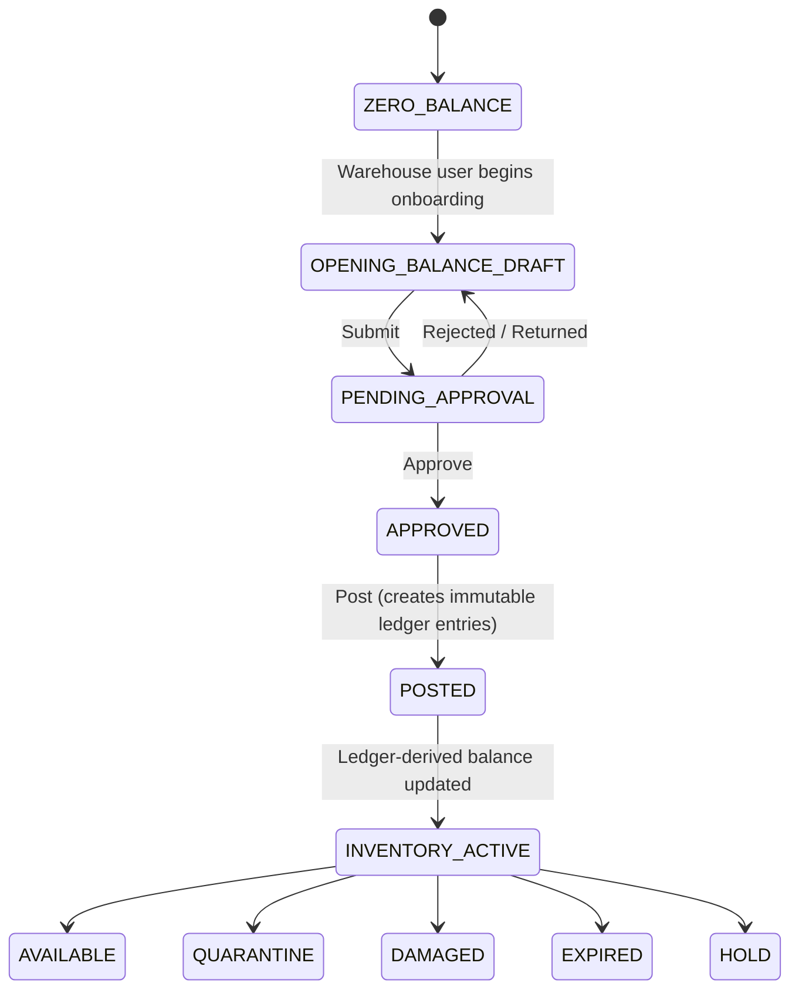
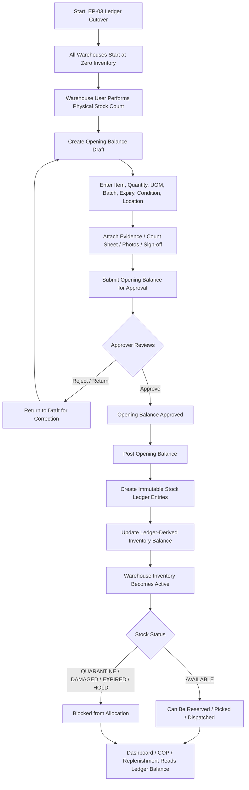

# DMIS EP-03 — Stockpile/Warehouse Operations: Design + Sprint 1 Implementation Plan

## Context

**Why this change exists.** EP-03 (Stockpile/Warehouse Operations) is the inventory-accuracy backbone for Jamaica's ODPEM disaster response. Today the system reads legacy `inventory`, `itembatch`, and `warehouse` tables but has **no inventory mutation discipline**: no immutable stock ledger, no controlled source types, no opening-balance workflow, no segregation of duties on stock adjustments, no negative-balance guard, no FEFO/FIFO enforcement. EP-02 (replenishment) and operations (relief/dispatch) workflows are downstream of EP-03 — they cannot be trusted in production until inventory is trustworthy.

**Cutover model — ZERO BALANCE START.** DMIS inventory shall start from a **zero-balance position**. The system does **not** treat any existing legacy inventory record as available, reserved, expired, defective, quarantined, or in-transit. Authorized warehouse users must establish DMIS inventory by performing a **physical stock count** and posting it through the **Opening Balance** workflow.

**Governing rule (non-negotiable):**
> Opening Balance is a controlled physical-count onboarding process, not a migration of legacy inventory balances. DMIS inventory begins at zero and becomes available only after approved Opening Balance posting.

This means:
- The system shall **not** auto-populate Opening Balance from legacy `inventory` / `itembatch` / warehouse stock tables.
- Legacy stock tables shall **not** be treated as inventory truth after EP-03 cutover.
- When an Opening Balance is posted, the system shall create immutable `stock_ledger` entries and update the **ledger-derived** inventory balance only. It shall **not** mirror into, write to, or attempt to reconcile with legacy inventory tables.
- All downstream readers (Inventory Dashboard, COP, EP-02 replenishment needs lists, operations dispatch availability) read the **ledger-derived** balance from Sprint 1 forward.

**What this plan delivers.** A comprehensive **design** for all 60 Must-Have FRs in EP-03 Phase 1 and Phase 2 (excluding Sage Integration FR03.23a/b/24a/b and the Warehouse-Location Hierarchy FR03.45/47/48), plus a **Sprint 1 implementation cut** that puts a production-ready inventory foundation in place. Per the user's directive, **only Opening Balance is operationally used** in production after this build; the other 9 inventory source types from FR03.26 are configured (seeded into `StockSourceType`) and architecturally supported by the ledger, but their workflows (GRN, counts, write-offs, returns, reversals, quarantine release, transformations, imports, adjustments) ship in subsequent sprints.

**Intended outcome.** After Sprint 1: every warehouse begins at `ZERO_BALANCE`. Authorized warehouse users perform a physical count, capture it as an Opening Balance draft (with evidence: count sheets, photos, sign-off), submit for approval, and once approved + posted, the warehouse transitions to `INVENTORY_ACTIVE` with ledger-truth balances. The Inventory Dashboard, COP, and EP-02/replenishment views read from the ledger-derived view from go-live. The foundation (immutable ledger, status state machine, segregation of duties, evidence, audit, RBAC, rate limits, exceptions) is in place so subsequent sprints can plug in the remaining source-type workflows without re-architecting.

### Canonical Workflow Diagrams (authoritative for this plan)

**Opening Balance lifecycle (warehouse-level inventory state):**


**End-to-end OB cutover process:**


---

## In-Scope FRs (60 Must-Have)

### Phase 1 (14 FRs)
- **Inventory Dashboard:** FR03.01, .02, .03, .04
- **FEFO/FIFO Enforcement:** FR03.05, .06
- **Expiry Management:** FR03.07, .08
- **Physical Count & Variance:** FR03.09, .10
- **Write-Off & Disposal:** FR03.11
- **Stock Alerts & Traceability:** FR03.13, .14
- **Item Master & Stock Health:** FR03.15, .16

### Phase 2 (46 FRs)
- **UOM Conversion & Repackaging:** FR03.17, .18, .19
- **Item Provenance:** FR03.20
- **Inventory Source Control:** FR03.25, .26
- **Stock Ledger & Audit Trail:** FR03.27, .73
- **Goods Receipt:** FR03.28
- **Opening Balance:** FR03.29, .30 *(actively used in Sprint 1)*
- **Stock Adjustment:** FR03.31, .32
- **Field Return:** FR03.33, .34
- **Dispatch Reversal:** FR03.35, .36
- **Quarantine Management:** FR03.37, .38, .64, .65
- **Data Import:** FR03.40, .41
- **Stock Transformation:** FR03.42, .43, .44
- **Warehouse Location (flat):** FR03.46
- **Stock Status Management:** FR03.49, .50
- **Reservation & Allocation:** FR03.51, .52
- **Picking & Dispatch:** FR03.53, .54
- **Inventory Integrity:** FR03.55
- **Cycle Count:** FR03.56, .57, .58, .59
- **Variance Management:** FR03.60, .61, .62
- **Segregation of Duties:** FR03.63
- **Evidence & Documentation:** FR03.67, .74
- **Record Retention:** FR03.79
- **Exception Dashboard:** FR03.80

### Out of Scope (explicit)
- Sage Integration: FR03.23a, .23b, .24a, .24b
- Warehouse-Location Hierarchy + Put-Away Rules: FR03.45, .47, .48 (deferred to Sprint 2; flat `location` table only — FR03.46 stays)
- All Should-Have FRs (.12, .21, .22, .39, .66, .68, .69–72, .77, .78)
- Phase 3 FRs (.69–72, .75, .76, .77, .78)

---

## Sprint 1 Cut — Implementation vs. Configuration

| Area | Sprint 1 Implementation | Sprint 1 Configuration / Scaffold | Deferred |
|------|-------------------------|------------------------------------|----------|
| Ledger framework (FR03.25, .26, .27, .55, .73) | **Built** — immutable ORM table + writer service + DB trigger blocking UPDATE/DELETE | All 10 source types seeded; all 14 stock statuses seeded | — |
| Opening Balance (FR03.29, .30) | **Built end-to-end as a physical-count onboarding workflow** — warehouse begins at ZERO_BALANCE; user performs physical stock count; creates OB draft; enters per-line item/qty/UOM/batch/expiry/condition/location; attaches evidence (count sheets, photos, sign-off); submits; approver reviews → approve OR reject/return; on approve, post creates immutable ledger entries; warehouse transitions to INVENTORY_ACTIVE. **No backfill from legacy inventory.** | — | — |
| Stock Status state machine (FR03.49, .50) | **Built** — enforced at every ledger write | — | — |
| Inventory Dashboard (FR03.01–.04, .13, .16) | **Built** — reads ledger-derived materialized view | — | — |
| Item Provenance (FR03.20) | **Built** — read-only timeline over `stock_ledger` | — | PDF export (Should-Have) |
| Item master (FR03.15) | Already implemented (masterdata) | — | — |
| Expiry alerts (FR03.07, .08) | **Built** — nightly scan + block expired allocation | — | — |
| Batch/lot traceability (FR03.14) | **Built** — surfaced through ledger `batch_id` join | — | — |
| FEFO/FIFO recommendation (FR03.05, .06, .53) | **Built** — read-side ranking helper | — | — |
| Pick confirmation (FR03.54) | **Built** — verifies item/batch/location/qty/dest | — | — |
| Reservations (FR03.51, .52) | **Built** — advisory-locked reserve/release | — | — |
| Negative-balance prevention (FR03.55) | **Built** — assertion in ledger writer | — | — |
| Segregation of duties (FR03.63) | **Built** — `services/sod.py` helper, applied at all approve endpoints | — | — |
| Evidence & attachments (FR03.67, .74) | **Built** — upload + hash + retention | — | — |
| Audit trail (FR03.73) | **Built** — `InventoryAuditLog` ORM with DB trigger | — | — |
| Exception dashboard (FR03.80) | **Built** — for OB-related exceptions only | All exception types defined | Exception detection for non-OB workflows |
| GRN (FR03.28) | — | **Model + migration** — `GoodsReceiptNote`, `GRNLine` tables created so legacy donation/procurement/transfer modules can begin emitting GRN drafts | Service, view, UI |
| Stock Adjustment (FR03.31, .32) | — | **Model + migration** | Service, view, UI |
| Stock Count + Cycle Count (FR03.09, .10, .56–.59) | — | **Model + migration** | Service, view, UI |
| Write-Off (FR03.11) | — | **Model + migration** | Service, view, UI |
| Quarantine (FR03.37, .38, .64, .65) | — | **Model + migration** | Service, view, UI |
| Field Return (FR03.33, .34) | — | **Model + migration** | Service, view, UI |
| Dispatch Reversal (FR03.35, .36) | — | **Model + migration** | Service, view, UI |
| Data Import (FR03.40, .41) | — | **Model + migration** | Service, view, UI |
| Stock Transformation (FR03.42–.44) | Repackaging already in `replenishment/services/repackaging.py` | **Model + migration** for `StockTransformation` parent-child header | Kit/de-kit/split/consolidate UI |
| Variance Reasons / Root Cause (FR03.60–.62) | Lookup tables seeded | — | UI surfacing in adjustment & count workflows |
| Record retention (FR03.79) | Configuration captured in `RecordRetentionPolicy` ORM | — | Automated purge job |

---

## Architecture & Module Layout

### New Django app: `backend/inventory/`

Created alongside `replenishment`, `operations`, `masterdata`. Follows the existing modular monolith pattern. Net-new ORM tables use Django auto-migrations (per user direction); legacy `warehouse` / `inventory` / `itembatch` continue to be read via the existing `replenishment/services/data_access.py` raw-SQL helpers.

```text
backend/inventory/
  __init__.py
  apps.py                            # AppConfig: name='inventory', verbose_name='Inventory & Stockpile'
  models.py                          # All EP-03 ORM models (foundation built; workflow models scaffolded)
  permissions.py                     # DRF permission classes per workflow
  serializers.py                     # DRF serializers
  urls.py                            # Mounted at /api/v1/inventory/
  views.py                           # Function-based views with @api_view (matches replenishment style)
  selectors.py                       # Read-side queries (dashboard, drill-down, provenance)
  throttling.py                      # Inventory-specific rate-limit scopes
  exceptions.py                      # InventoryError, NegativeBalanceError, StatusTransitionError, etc.
  services/
    __init__.py
    ledger.py                        # post_entry() — single chokepoint for ledger writes
    statuses.py                      # Stock-status state-machine validator
    source_types.py                  # Source-type registry helper
    opening_balance.py               # OB create/edit/submit/approve/post (Sprint 1 active workflow)
    reservations.py                  # reserve()/release() with advisory locks
    picking.py                       # FEFO/FIFO ranking + pick.confirm
    expiry.py                        # 90/60/30/7-day scan + alert producer
    provenance.py                    # Item provenance timeline builder
    exceptions_detector.py           # detect_and_record() for FR03.80
    evidence.py                      # File upload + hash + GET helper
    sod.py                           # assert_different_actor()
    idempotency.py                   # Idempotency-Key store
    selectors.py                     # Reusable read-side helpers
  management/
    __init__.py
    commands/
      seed_inventory_lookups.py      # Seed StockSourceType, StockStatus, reason codes
      backfill_opening_balance_draft.py  # Pre-populate OB drafts from current legacy inventory
      expire_stock_scan.py           # Cron entry point for FR03.07
      detect_inventory_exceptions.py # Cron entry point for FR03.80
  migrations/
    0001_initial.py                  # All ORM tables (foundation + scaffolded workflow tables)
    0002_immutable_ledger_trigger.py # Django RunSQL: PG trigger blocking UPDATE/DELETE on stock_ledger + inventory_audit_log
    0003_seed_lookups.py             # Data migration: 10 source types, 14 statuses, reason codes
    0004_dashboard_view.py           # Materialized view v_inventory_dashboard
  tests_models.py
  tests_ledger.py
  tests_opening_balance.py
  tests_reservations.py
  tests_picking.py
  tests_expiry.py
  tests_provenance.py
  tests_exceptions.py
  tests_sod.py
  tests_idor.py
  tests_audit_immutability.py
  tests_views.py
```

### Naming consistency

- All new models inherit from `replenishment.models.AuditedModel` (create_by_id, create_dtime, update_by_id, update_dtime, version_nbr) for audit-field consistency with EP-02.
- All new tables use snake_case names that **do not collide** with legacy table names (`stock_ledger`, `goods_receipt_note`, `stock_count`, `stock_writeoff`, `quarantine_case`, etc.). Avoids the `inventory` collision by namespacing future entities like `inventory_source_type`, `inventory_audit_log`.

---

## Data Model

### Foundation tables (built and exercised in Sprint 1)

**`inventory_source_type`** — FR03.25, .26
```python
class StockSourceType(models.Model):
    code = models.CharField(max_length=40, primary_key=True)
    description = models.CharField(max_length=255)
    increases_total_on_hand = models.BooleanField()
    increases_available_only = models.BooleanField(default=False)
    requires_approval = models.BooleanField()
    requires_grn = models.BooleanField()
    is_active = models.BooleanField(default=True)
    sort_order = models.IntegerField(default=0)
    class Meta:
        db_table = "inventory_source_type"
```
Seeded values: DONATION_RECEIPT, PROCUREMENT_RECEIPT, TRANSFER_RECEIPT, OPENING_BALANCE, POSITIVE_ADJUSTMENT, FIELD_RETURN, DISPATCH_REVERSAL, QUARANTINE_RELEASE, REPACK_KIT_OUTPUT, DATA_IMPORT.

**`inventory_status`** — FR03.49, .50
```python
class StockStatus(models.Model):
    code = models.CharField(max_length=40, primary_key=True)
    description = models.CharField(max_length=255)
    is_available_for_allocation = models.BooleanField(default=False)  # FR03.50 gate
    is_terminal = models.BooleanField(default=False)
    sort_order = models.IntegerField(default=0)
    class Meta:
        db_table = "inventory_status"
```
Seeded values: AVAILABLE, RESERVED, QUARANTINE, DAMAGED, EXPIRED, HOLD, RETURN_PENDING, DISPOSAL_PENDING, IN_TRANSIT, PICKED, STAGED, ISSUED, RETURNED, DISPOSED.

**`inventory_status_transition`** — explicit allowed transitions
```python
class StockStatusTransition(models.Model):
    from_status = models.ForeignKey(StockStatus, related_name="from_transitions")
    to_status = models.ForeignKey(StockStatus, related_name="to_transitions")
    required_permission = models.CharField(max_length=80, blank=True)
    class Meta:
        db_table = "inventory_status_transition"
        unique_together = [["from_status", "to_status"]]
```

**`stock_ledger`** — FR03.27, .55, .73 (immutable, append-only)
```python
class StockLedger(AuditedModel):
    ledger_id = models.BigAutoField(primary_key=True)
    source_type = models.ForeignKey(StockSourceType, on_delete=models.PROTECT)
    reference_type = models.CharField(max_length=40)            # OPENING_BALANCE, GRN, COUNT, WRITEOFF, etc.
    reference_id = models.CharField(max_length=64)              # the workflow row's PK (string-typed for flexibility)
    tenant_id = models.IntegerField()
    warehouse_id = models.IntegerField()
    location_id = models.IntegerField(null=True, blank=True)
    item_id = models.IntegerField()
    batch_id = models.IntegerField(null=True, blank=True)
    batch_no = models.CharField(max_length=40, blank=True)
    expiry_date = models.DateField(null=True, blank=True)
    quantity_default_uom = models.DecimalField(max_digits=18, decimal_places=6)
    direction = models.CharField(max_length=10)                 # IN, OUT, NEUTRAL
    from_status = models.ForeignKey(StockStatus, null=True, blank=True, related_name="ledger_from")
    to_status = models.ForeignKey(StockStatus, related_name="ledger_to")
    parent_ledger_id = models.BigIntegerField(null=True, blank=True)  # for transformations (FR03.44)
    reason_code = models.CharField(max_length=40, blank=True)
    reason_text = models.TextField(blank=True)
    actor_id = models.CharField(max_length=20)
    posted_at = models.DateTimeField(auto_now_add=True)
    request_id = models.CharField(max_length=36, blank=True)
    idempotency_key = models.CharField(max_length=64, blank=True)
    class Meta:
        db_table = "stock_ledger"
        indexes = [
            models.Index(fields=["tenant_id", "warehouse_id", "item_id", "posted_at"]),
            models.Index(fields=["reference_type", "reference_id"]),
            models.Index(fields=["expiry_date"]),
            models.Index(fields=["batch_id"]),
            models.Index(fields=["idempotency_key"]),
        ]
```
Immutability enforced via PostgreSQL trigger (migration 0002):
```sql
CREATE OR REPLACE FUNCTION reject_stock_ledger_modification() RETURNS trigger AS $$
BEGIN RAISE EXCEPTION 'stock_ledger is append-only'; RETURN NULL; END;
$$ LANGUAGE plpgsql;
CREATE TRIGGER stock_ledger_block_update BEFORE UPDATE ON stock_ledger
    FOR EACH ROW EXECUTE FUNCTION reject_stock_ledger_modification();
CREATE TRIGGER stock_ledger_block_delete BEFORE DELETE ON stock_ledger
    FOR EACH ROW EXECUTE FUNCTION reject_stock_ledger_modification();
```

**`inventory_audit_log`** — FR03.73 (workflow-action audit; immutable like above)
```python
class InventoryAuditLog(models.Model):
    audit_id = models.BigAutoField(primary_key=True)
    entity_type = models.CharField(max_length=40)               # OB, GRN, COUNT, WRITEOFF, etc.
    entity_id = models.CharField(max_length=64)
    action = models.CharField(max_length=40)                    # CREATE, EDIT, SUBMIT, APPROVE, POST, REJECT, CANCEL
    actor_id = models.CharField(max_length=20)
    tenant_id = models.IntegerField()
    request_id = models.CharField(max_length=36, blank=True)
    before_state = models.JSONField(default=dict)              # bounded 64KB, PII-masked (SF8)
    after_state = models.JSONField(default=dict)               # bounded 64KB, PII-masked (SF8)
    reason_text = models.TextField(blank=True)
    occurred_at = models.DateTimeField(auto_now_add=True)
    class Meta:
        db_table = "inventory_audit_log"
        indexes = [models.Index(fields=["entity_type", "entity_id", "occurred_at"])]
```
Same UPDATE/DELETE block trigger as `stock_ledger`. Per architecture review SF8, before/after JSON payloads pass through a serializer in `services/audit.py` that masks PII fields (notes, free text), bounds payload to 64KB max (truncated with `..._truncated: true` marker), and validates schema. Rejection rather than silent drop on overflow.

**`stock_evidence`** — FR03.67, .74
```python
class StockEvidence(models.Model):
    evidence_id = models.BigAutoField(primary_key=True)
    related_entity = models.CharField(max_length=40)            # OB, GRN, COUNT, etc.
    related_id = models.CharField(max_length=64)
    file_path = models.CharField(max_length=255)
    file_hash = models.CharField(max_length=64)
    file_size_bytes = models.BigIntegerField()
    mime_type = models.CharField(max_length=80)
    description = models.CharField(max_length=255, blank=True)
    uploaded_by_id = models.CharField(max_length=20)
    uploaded_at = models.DateTimeField(auto_now_add=True)
    class Meta:
        db_table = "stock_evidence"
        indexes = [models.Index(fields=["related_entity", "related_id"])]
```

**`stock_reservation`** — FR03.51, .52
```python
class StockReservation(AuditedModel):
    reservation_id = models.AutoField(primary_key=True)
    tenant_id = models.IntegerField()
    warehouse_id = models.IntegerField()
    item_id = models.IntegerField()
    batch_id = models.IntegerField(null=True, blank=True)
    location_id = models.IntegerField(null=True, blank=True)
    quantity_default_uom = models.DecimalField(max_digits=18, decimal_places=6)
    target_type = models.CharField(max_length=40)               # PACKAGE, TRANSFER, REPLENISHMENT, DISPATCH
    target_id = models.CharField(max_length=64)
    status = models.CharField(max_length=20)                    # ACTIVE, RELEASED, CONSUMED
    reserved_at = models.DateTimeField(auto_now_add=True)
    released_at = models.DateTimeField(null=True, blank=True)
    class Meta:
        db_table = "stock_reservation"
        indexes = [models.Index(fields=["tenant_id", "warehouse_id", "item_id", "batch_id", "status"])]
```
FR03.52 enforced via service-layer advisory lock + `SUM(active_reservation_qty) <= available_qty` assertion.

**`warehouse_inventory_state`** — tracks the warehouse-level OB lifecycle state distinct from per-stock-row stock statuses. (See state diagram in Context.)
```python
class WarehouseInventoryState(AuditedModel):
    state_id = models.AutoField(primary_key=True)
    tenant_id = models.IntegerField()
    warehouse_id = models.IntegerField(unique=True)
    state_code = models.CharField(max_length=30)
        # ZERO_BALANCE | OPENING_BALANCE_DRAFT | PENDING_APPROVAL | APPROVED | POSTED | INVENTORY_ACTIVE
    current_ob_id = models.IntegerField(null=True, blank=True)  # links to active OB record (if any)
    activated_at = models.DateTimeField(null=True, blank=True)  # set on first POSTED → INVENTORY_ACTIVE transition
    last_state_change_at = models.DateTimeField(auto_now=True)
    class Meta:
        db_table = "warehouse_inventory_state"
        indexes = [models.Index(fields=["tenant_id", "state_code"])]
```
Initial seed: every warehouse row in legacy `warehouse` gets a `WarehouseInventoryState(state_code="ZERO_BALANCE")` row inserted by migration `0006_seed_warehouse_states`. Subsequent OB operations transition the state per the state diagram.

Key behavior:
- A warehouse remains in `ZERO_BALANCE` until the first OB draft is created → transitions to `OPENING_BALANCE_DRAFT`.
- Multiple OB cycles are allowed (e.g., a warehouse can return to `OPENING_BALANCE_DRAFT` for additional onboarding lines AFTER reaching `INVENTORY_ACTIVE`); `current_ob_id` always points to the latest in-flight OB.
- Once a warehouse is `INVENTORY_ACTIVE`, it stays there permanently. Future inventory mutations come from the other source types (GRN, count, etc., shipped in later sprints).
- `WarehouseInventoryState` is the **single source of truth** for the answer to "Is this warehouse onboarded yet?" — used by the Inventory Dashboard to render an explicit "Pending Onboarding" badge and by EP-02 / Operations to gate availability queries.

**`stock_idempotency`**
```python
class StockIdempotency(models.Model):
    key_hash = models.CharField(max_length=64, primary_key=True)   # SHA256(actor+endpoint+key)
    actor_id = models.CharField(max_length=20)
    endpoint = models.CharField(max_length=120)
    response_status = models.IntegerField()
    response_body = models.JSONField(default=dict)
    created_at = models.DateTimeField(auto_now_add=True)
    class Meta:
        db_table = "stock_idempotency"
        indexes = [models.Index(fields=["created_at"])]
```
24-hour purge handled by management command.

**`stock_exception`** — FR03.80
```python
class StockException(AuditedModel):
    exception_id = models.BigAutoField(primary_key=True)
    exception_type = models.CharField(max_length=60)
    severity = models.CharField(max_length=20)                  # LOW, MEDIUM, HIGH, CRITICAL
    tenant_id = models.IntegerField()
    warehouse_id = models.IntegerField(null=True, blank=True)
    related_entity = models.CharField(max_length=40, blank=True)
    related_id = models.CharField(max_length=64, blank=True)
    detail = models.JSONField(default=dict)
    detected_at = models.DateTimeField(auto_now_add=True)
    resolved = models.BooleanField(default=False)
    resolved_at = models.DateTimeField(null=True, blank=True)
    resolved_by_id = models.CharField(max_length=20, blank=True)
    class Meta:
        db_table = "stock_exception"
```
Exception types defined as Python enum — Sprint 1 actively detects only OB-related types: `NEGATIVE_BALANCE_ATTEMPT`, `EXPIRED_ALLOC_ATTEMPT`, `MANUAL_OVERRIDE`, `PENDING_APPROVAL_OVERDUE_OB`. Other types (overdue counts, unresolved variances, overdue quarantine, etc.) defined but no detector wired — Sprint 2+.

### Active workflow table (Sprint 1)

**`opening_balance` + `opening_balance_line`** — FR03.29, .30
```python
class OpeningBalance(AuditedModel):
    ob_id = models.AutoField(primary_key=True)
    ob_number = models.CharField(max_length=40, unique=True)    # e.g., OB-WH001-2026-001
    purpose = models.CharField(max_length=20)                   # GO_LIVE, ONBOARD_WAREHOUSE, MIGRATION
    tenant_id = models.IntegerField()
    warehouse_id = models.IntegerField()
    status_code = models.CharField(max_length=20)               # DRAFT, PENDING_APPROVAL, APPROVED, POSTED, REJECTED, CANCELLED
    requested_by_id = models.CharField(max_length=20)
    submitted_at = models.DateTimeField(null=True, blank=True)
    approved_by_id = models.CharField(max_length=20, blank=True)
    approved_at = models.DateTimeField(null=True, blank=True)
    posted_at = models.DateTimeField(null=True, blank=True)
    rejected_by_id = models.CharField(max_length=20, blank=True)
    rejection_reason = models.TextField(blank=True)
    notes = models.TextField(blank=True)
    line_count = models.IntegerField(default=0)
    total_default_qty = models.DecimalField(max_digits=20, decimal_places=6, default=0)
    class Meta:
        db_table = "opening_balance"
        indexes = [
            models.Index(fields=["tenant_id", "warehouse_id", "status_code"]),
            models.Index(fields=["status_code", "submitted_at"]),
        ]

class OpeningBalanceLine(AuditedModel):
    line_id = models.AutoField(primary_key=True)
    ob = models.ForeignKey(OpeningBalance, on_delete=models.CASCADE, related_name="lines")
    item_id = models.IntegerField()
    uom_code = models.CharField(max_length=10)                  # entered UOM
    quantity = models.DecimalField(max_digits=18, decimal_places=6)
    quantity_default_uom = models.DecimalField(max_digits=18, decimal_places=6)  # converted via UOM rules
    batch_no = models.CharField(max_length=40, blank=True)
    expiry_date = models.DateField(null=True, blank=True)
    location_id = models.IntegerField(null=True, blank=True)
    initial_status_code = models.CharField(max_length=20)       # AVAILABLE | QUARANTINE | DAMAGED
    line_notes = models.TextField(blank=True)
    posted_ledger_id = models.BigIntegerField(null=True, blank=True)  # backlink after post
    class Meta:
        db_table = "opening_balance_line"
        indexes = [models.Index(fields=["ob"])]
```

### Scaffolded workflow tables (Sprint 1: model + migration only)

Each ORM model lands in `inventory/models.py` with the same `AuditedModel` base, identical tenant/warehouse/status fields, and the workflow-specific columns from the original FR description. **No services or views are wired** — the model exists so future sprints can attach views and the legacy donation/procurement modules can begin emitting draft rows during Sprint 2.

- `goods_receipt_note`, `grn_line` — FR03.28
- `stock_count`, `stock_count_line` — FR03.09, .10, .56–.59
- `stock_writeoff` — FR03.11
- `quarantine_case` — FR03.37, .38, .64, .65
- `field_return`, `field_return_line` — FR03.33, .34
- `dispatch_reversal` — FR03.35, .36
- `stock_adjustment` — FR03.31, .32, .60–.62
- `stock_transformation` — FR03.42–.44 (header; line is `stock_ledger.parent_ledger_id`)
- `data_import_batch`, `data_import_line` — FR03.40, .41
- `record_retention_policy` — FR03.79

### Reference table additions (master-data CRUD via existing `TABLE_REGISTRY`)

Add to `backend/masterdata/services/data_access.py TABLE_REGISTRY`:
- `stock_source_type` → table `inventory_source_type`
- `stock_status` → table `inventory_status`
- `variance_reason_code` → new lookup table `variance_reason_code` (FR03.60)
- `writeoff_reason_code` → new lookup table `writeoff_reason_code`
- `quarantine_reason_code` → new lookup table `quarantine_reason_code`
- `uom_conversion` → existing `uom_conversion` (already used by `repackaging.py`); expose CRUD UI
- `count_threshold` → new lookup table `count_threshold` (FR03.10, .59 — variance pct, qty, value triggers per item category)

Each gets a `frontend/src/app/master-data/models/table-configs/*.config.ts` and a route entry.

---

## Service Layer & Invariants

### `services/ledger.py` — the single chokepoint

```python
def post_entry(
    *,
    source_type_code: str,
    reference_type: str,
    reference_id: str,
    tenant_id: int,
    warehouse_id: int,
    item_id: int,
    quantity_default_uom: Decimal,
    direction: str,                                  # IN | OUT | NEUTRAL
    to_status_code: str,
    from_status_code: str | None = None,
    location_id: int | None = None,
    batch_id: int | None = None,
    batch_no: str = "",
    expiry_date: date | None = None,
    parent_ledger_id: int | None = None,
    reason_code: str = "",
    reason_text: str = "",
    actor_id: str,
    request_id: str = "",
    idempotency_key: str = "",
) -> StockLedger:
    """
    Single chokepoint for ALL inventory mutations.
    Enforces FR03.25, .26, .27, .49, .50, .55, .73.
    """
    with transaction.atomic():
        if idempotency_key:
            existing = _check_idempotency(actor_id, "ledger.post_entry", idempotency_key)
            if existing: return existing

        # Advisory lock: serialize concurrent writes per (tenant, warehouse, item, batch)
        _acquire_pg_advisory_lock(tenant_id, warehouse_id, item_id, batch_id or 0)

        # Source-type whitelist (FR03.26)
        source = StockSourceType.objects.get(code=source_type_code, is_active=True)

        # Status state machine (FR03.49, .50)
        _assert_status_transition_allowed(from_status_code, to_status_code)

        # Compute new available + assert non-negative (FR03.55)
        current_available = _compute_current_available(tenant_id, warehouse_id, item_id, batch_id)
        delta = _signed_delta(direction, to_status_code, quantity_default_uom)
        new_available = current_available + delta
        if new_available < 0:
            StockException.objects.create(
                exception_type="NEGATIVE_BALANCE_ATTEMPT",
                severity="CRITICAL",
                tenant_id=tenant_id, warehouse_id=warehouse_id,
                related_entity=reference_type, related_id=reference_id,
                detail={"item_id": item_id, "delta": str(delta), "current": str(current_available)},
                create_by_id=actor_id, update_by_id=actor_id,
            )
            raise NegativeBalanceError(
                "Posting would result in negative available stock.",
                detail={"item_id": item_id, "current": current_available, "delta": delta},
            )

        # Insert immutable ledger row
        ledger = StockLedger.objects.create(
            source_type=source, reference_type=reference_type, reference_id=reference_id,
            tenant_id=tenant_id, warehouse_id=warehouse_id, location_id=location_id,
            item_id=item_id, batch_id=batch_id, batch_no=batch_no, expiry_date=expiry_date,
            quantity_default_uom=quantity_default_uom, direction=direction,
            from_status_id=from_status_code, to_status_id=to_status_code,
            parent_ledger_id=parent_ledger_id, reason_code=reason_code, reason_text=reason_text,
            actor_id=actor_id, request_id=request_id, idempotency_key=idempotency_key,
            create_by_id=actor_id, update_by_id=actor_id,
        )

        # ZERO-BALANCE CUTOVER MODEL — NO LEGACY MIRROR.
        # Per the governing rule, the system shall NOT mirror, write to, or attempt to
        # reconcile with legacy inventory tables. The ledger-derived view is the only
        # source of truth for operational reads (dashboard, COP, EP-02, dispatch).
        # The legacy `inventory` and `itembatch` tables are retained as historical
        # records but are not written to or read from for operational decisions.

        # Trigger ledger-derived dashboard refresh (debounced, on-commit)
        transaction.on_commit(lambda: _request_dashboard_refresh(tenant_id, warehouse_id))

        # Update warehouse inventory state machine (ZERO_BALANCE → ... → INVENTORY_ACTIVE)
        _advance_warehouse_state_if_needed(tenant_id, warehouse_id, source_type_code, ledger)

        # Audit log (FR03.73)
        InventoryAuditLog.objects.create(
            entity_type=reference_type, entity_id=reference_id, action="LEDGER_POST",
            actor_id=actor_id, tenant_id=tenant_id, request_id=request_id,
            before_state={"available": str(current_available)},
            after_state={"available": str(new_available), "ledger_id": ledger.ledger_id},
        )

        if idempotency_key:
            _store_idempotency(actor_id, "ledger.post_entry", idempotency_key, ledger)

        return ledger
```

**Why this design:**
- **One chokepoint** = one place to enforce every cross-cutting rule. All future workflow services (GRN, count, write-off, etc.) call `post_entry`; they never write to `stock_ledger` directly.
- **Advisory lock** keyed on `(tenant_id, warehouse_id, item_id, batch_id)` prevents concurrent over-allocation under load (FR03.52, .55).
- **Legacy mirror** keeps `replenishment/services/data_access.py` and `OperationsAllocationLine` working unchanged (no big-bang refactor).
- **Negative-balance attempts** become first-class exceptions surfaced in the dashboard (FR03.80).

### `services/opening_balance.py`

- `create_draft(actor, tenant_id, warehouse_id, purpose, notes, request_id)` → returns `OpeningBalance` with status DRAFT; logs audit.
- `add_lines(actor, ob_id, lines)` → validates each line (item exists, UOM exists in `uom_conversion` if non-default, expiry > today for AVAILABLE status, location belongs to warehouse via flat `location` table); converts to default UOM; persists.
- `submit(actor, ob_id, request_id)` → status DRAFT → PENDING_APPROVAL; SoD check (creator can't auto-approve); audit.
- `approve(actor, ob_id, request_id, idempotency_key)` → status PENDING_APPROVAL → APPROVED; **SoD: assert actor != requested_by_id**; audit. Routes via approval matrix:
  - Aggregate value < $500K JMD: Logistics Manager
  - $500K–$2M: Senior Director PEOD
  - $2M–$10M: Deputy DG
  - >$10M: Director General
  Approval valuation uses **manual unit-cost field on the line if provided** (Sage-out-of-scope means valuation is best-effort; line-level cost defaults to 0 if missing, with a flag in the UI).
- `post(actor, ob_id, idempotency_key)` → status APPROVED → POSTED; for each line, calls `ledger.post_entry(source_type_code="OPENING_BALANCE", reference_type="OPENING_BALANCE", reference_id=str(ob_id), direction="IN", to_status_code=line.initial_status_code, ...)`; updates `posted_ledger_id` on each line; audit.
- `reject(actor, ob_id, reason)` and `cancel(actor, ob_id, reason)` similarly gated.

### `services/reservations.py`

- `reserve(actor, tenant_id, warehouse_id, item_id, qty, target_type, target_id, batch_id=None, location_id=None)`:
  1. Acquire advisory lock on segment.
  2. Compute `available = ledger_in - ledger_out - active_reservations` (per item/batch).
  3. If `qty > available`: raise `InsufficientAvailabilityError` (409); log exception.
  4. Insert `StockReservation(status=ACTIVE)`.
- `release(reservation_id)` → status ACTIVE → RELEASED.
- `consume(reservation_id, ledger_entry)` → status ACTIVE → CONSUMED; called by future dispatch flow.

### `services/picking.py`

- `recommend(item_id, qty_required, warehouse_id, tenant_id)` → returns ranked list:
  - Exclude rows where stock is not in AVAILABLE status (FR03.50).
  - Exclude expired (FR03.08).
  - Order: perishable → ascending `expiry_date` (FEFO, FR03.05); non-perishable → ascending `batch_date` (FIFO, FR03.06).
  - Ties broken by location_id ascending.
- `confirm(actor, item_id, batch_id, location_id, qty, target_type, target_id, idempotency_key)` → verifies all match the reservation; calls `ledger.post_entry(direction="OUT", to_status_code="PICKED", ...)`. (FR03.54)

### `services/expiry.py` (background — `manage.py expire_stock_scan`)

For every batch with expiry_date in (today+90, today+60, today+30, today+7):
- Emit alert event (mail/notification + dashboard widget).
- Insert `StockException(exception_type="EXPIRY_WARNING", severity per band)`.
- Reflect in inventory dashboard expiry pill.

### `services/sod.py` — segregation-of-duties helper

```python
def assert_different_actor(*, actor_id: str, originator_id: str, action: str) -> None:
    if actor_id == originator_id:
        raise SegregationOfDutyError(
            f"Action '{action}' cannot be performed by the same user who created the request.",
        )
```
Called by every approve/post endpoint. (FR03.63, BR01.15)

### `services/exceptions_detector.py`

Sprint 1 detects and records:
- `OB_PENDING_APPROVAL_OVERDUE` — submitted_at > 24h ago, still PENDING_APPROVAL.
- `EXPIRED_ALLOC_ATTEMPT` — recorded inline by `picking.confirm` when caller passes expired batch.
- `NEGATIVE_BALANCE_ATTEMPT` — recorded inline by `ledger.post_entry`.
- `MANUAL_OVERRIDE` — recorded by approve endpoints when override flag is set.

Other types (`OVERDUE_COUNT`, `UNRESOLVED_VARIANCE`, `OVERDUE_QUARANTINE`, `PENDING_RETURN`, `PENDING_REVERSAL`, `FAILED_IMPORT`) defined as enum but no detector — Sprint 2.

### `selectors.py` — read-side

**DESIGN GUARDRAIL (operational vs reporting separation):**
> `v_inventory_dashboard` may be used for reporting and dashboard display, but operational balance checks for allocation, dispatch, reservation, negative-balance prevention, replenishment eligibility, and warehouse onboarding validation shall use a transactionally reliable balance source — direct ledger-derived query or `inventory_balance_aggregate` if implemented (see Inventory Balance Aggregate Fallback section). Operational selectors MUST NOT rely solely on `v_inventory_dashboard` if that view can become stale.

The inventory module exposes **two distinct selector families** that are not interchangeable:

**Dashboard / reporting selectors** (may use the materialized view):
- `inventory_dashboard(tenant_ids, filters)` (FR03.01–.04, .13, .16) — queries `v_inventory_dashboard`.
- `warehouse_drilldown(warehouse_id, ...)`
- `item_drilldown(item_id, ...)`
- `stock_health_indicator(item_id, warehouse_id, reorder_qty)` returns GREEN/AMBER/RED + ratio (FR03.16).
- `provenance_timeline(item_id, batch_id=None)` (FR03.20) — direct ledger query (already authoritative; safe).

**Operational balance selectors** (MUST use ledger-direct or aggregate-table read; never the dashboard view):
- `compute_available(tenant_id, warehouse_id, item_id, batch_id=None)` — returns the current AVAILABLE quantity from a transactionally reliable source. Used by reservations, picking, dispatch, replenishment availability checks, negative-balance assertion.
- `compute_status_balance(tenant_id, warehouse_id, item_id, status_code, batch_id=None)` — returns quantity in a specific stock status (RESERVED, QUARANTINE, etc.).
- `assert_warehouse_inventory_active(tenant_id, warehouse_id)` — raises `WarehouseNotOnboardedError` when `WarehouseInventoryState.state_code != "INVENTORY_ACTIVE"`.
- `assert_available_for_reservation(tenant_id, warehouse_id, item_id, qty, batch_id=None)` — combined gate used by reservation create.
- `assert_no_negative_balance(tenant_id, warehouse_id, item_id, delta, batch_id=None)` — combined gate used by ledger writer.

These operational selectors initially read from a direct ledger aggregation query (a sub-SELECT against `stock_ledger` filtered by tenant/warehouse/item/batch/status with SUM signed by direction). They do not call `v_inventory_dashboard`. If the direct ledger aggregation shows acceptable performance during Day 9 load testing, Sprint 1 ships with this approach. If aggregation cost is too high, the Inventory Balance Aggregate Fallback (below) is activated.

### Inventory Balance Aggregate Fallback

If `REFRESH MATERIALIZED VIEW CONCURRENTLY v_inventory_dashboard` shows lock contention, stale operational balances, or unacceptable refresh latency — OR if the direct ledger aggregation under load shows query times that violate response-time NFRs — Sprint 1 introduces a transactionally maintained `inventory_balance_aggregate` table:

```python
class InventoryBalanceAggregate(models.Model):
    aggregate_id = models.BigAutoField(primary_key=True)
    tenant_id = models.IntegerField()
    warehouse_id = models.IntegerField()
    item_id = models.IntegerField()
    batch_id = models.IntegerField(null=True, blank=True)
    location_id = models.IntegerField(null=True, blank=True)
    status = models.ForeignKey(StockStatus, on_delete=models.PROTECT)
    quantity_default_uom = models.DecimalField(max_digits=18, decimal_places=6, default=0)
    last_ledger_id = models.BigIntegerField(null=True, blank=True)  # latest ledger row that touched this aggregate
    updated_at = models.DateTimeField(auto_now=True)
    class Meta:
        db_table = "inventory_balance_aggregate"
        unique_together = [["tenant_id", "warehouse_id", "item_id", "batch_id", "location_id", "status"]]
        indexes = [
            models.Index(fields=["tenant_id", "warehouse_id", "item_id", "status"]),
            models.Index(fields=["last_ledger_id"]),
        ]
```

Behavior:
- `inventory_balance_aggregate` is updated **inside the same transaction** as `stock_ledger.post_entry` so it is always consistent with the ledger at any visible commit.
- The immutable `stock_ledger` remains the **source of truth**. The aggregate is a **derived, fast-read operational balance table**.
- Operational selectors (`compute_available`, `compute_status_balance`, etc.) switch to reading from `inventory_balance_aggregate`.
- Dashboard / reporting selectors continue to use `v_inventory_dashboard`.
- Failure mode: if a transactional aggregate update fails, the ledger insert fails too (single transaction). There is no possibility of divergence.
- Activation trigger: documented under "Day 9 — hardening + perf" with explicit decision criteria. Activation requires migration `0007_inventory_balance_aggregate.py` (additive; reversible) plus a one-time backfill management command `manage.py rebuild_inventory_balance_aggregate` that scans `stock_ledger` and populates the aggregate. The backfill is idempotent.

---

## Permission Catalog

Add to `backend/api/rbac.py`:

```python
# Inventory module — Sprint 1 active permissions
PERM_INVENTORY_VIEW = "inventory.view"
PERM_INVENTORY_LEDGER_VIEW = "inventory.ledger.view"
PERM_INVENTORY_PROVENANCE_VIEW = "inventory.provenance.view"
PERM_INVENTORY_EXCEPTION_VIEW = "inventory.exception.view"
PERM_INVENTORY_EXCEPTION_RESOLVE = "inventory.exception.resolve"

PERM_INVENTORY_OPENING_BALANCE_CREATE = "inventory.opening_balance.create"
PERM_INVENTORY_OPENING_BALANCE_EDIT = "inventory.opening_balance.edit"
PERM_INVENTORY_OPENING_BALANCE_SUBMIT = "inventory.opening_balance.submit"
PERM_INVENTORY_OPENING_BALANCE_APPROVE = "inventory.opening_balance.approve"
PERM_INVENTORY_OPENING_BALANCE_POST = "inventory.opening_balance.post"
PERM_INVENTORY_OPENING_BALANCE_REJECT = "inventory.opening_balance.reject"
PERM_INVENTORY_OPENING_BALANCE_CANCEL = "inventory.opening_balance.cancel"

PERM_INVENTORY_RESERVATION_VIEW = "inventory.reservation.view"
PERM_INVENTORY_RESERVATION_CREATE = "inventory.reservation.create"   # used by future modules
PERM_INVENTORY_PICK_RECOMMEND = "inventory.pick.recommend"
PERM_INVENTORY_PICK_CONFIRM = "inventory.pick.confirm"

PERM_INVENTORY_EVIDENCE_UPLOAD = "inventory.evidence.upload"
PERM_INVENTORY_EVIDENCE_VIEW = "inventory.evidence.view"
PERM_INVENTORY_EVIDENCE_DELETE = "inventory.evidence.delete"          # admin only

# Inventory module — scaffolded permissions (registered, no view yet)
PERM_INVENTORY_GRN_CREATE = "inventory.grn.create"
PERM_INVENTORY_GRN_VERIFY = "inventory.grn.verify"
PERM_INVENTORY_GRN_POST = "inventory.grn.post"
PERM_INVENTORY_COUNT_CREATE = "inventory.count.create"
PERM_INVENTORY_COUNT_FREEZE = "inventory.count.freeze"
PERM_INVENTORY_COUNT_SUBMIT = "inventory.count.submit"
PERM_INVENTORY_COUNT_APPROVE = "inventory.count.approve"
PERM_INVENTORY_COUNT_RECOUNT = "inventory.count.recount"
PERM_INVENTORY_WRITEOFF_REQUEST = "inventory.writeoff.request"
PERM_INVENTORY_WRITEOFF_APPROVE = "inventory.writeoff.approve"
PERM_INVENTORY_WRITEOFF_DISPOSE = "inventory.writeoff.dispose"
PERM_INVENTORY_ADJUSTMENT_REQUEST = "inventory.adjustment.request"
PERM_INVENTORY_ADJUSTMENT_APPROVE = "inventory.adjustment.approve"
PERM_INVENTORY_QUARANTINE_OPEN = "inventory.quarantine.open"
PERM_INVENTORY_QUARANTINE_INSPECT = "inventory.quarantine.inspect"
PERM_INVENTORY_QUARANTINE_RELEASE_REQUEST = "inventory.quarantine.release.request"
PERM_INVENTORY_QUARANTINE_RELEASE_APPROVE = "inventory.quarantine.release.approve"
PERM_INVENTORY_RETURN_RECEIVE = "inventory.return.receive"
PERM_INVENTORY_RETURN_INSPECT = "inventory.return.inspect"
PERM_INVENTORY_RETURN_POST = "inventory.return.post"
PERM_INVENTORY_REVERSAL_REQUEST = "inventory.reversal.request"
PERM_INVENTORY_REVERSAL_APPROVE = "inventory.reversal.approve"
PERM_INVENTORY_TRANSFORMATION_CREATE = "inventory.transformation.create"
PERM_INVENTORY_TRANSFORMATION_APPROVE = "inventory.transformation.approve"
PERM_INVENTORY_IMPORT_CREATE = "inventory.import.create"
PERM_INVENTORY_IMPORT_APPROVE = "inventory.import.approve"
PERM_INVENTORY_IMPORT_POST = "inventory.import.post"
```

### Role mapping (Sprint 1: existing roles only)

Per architecture review must-fix MF2, **no new roles are introduced in Sprint 1.** All `inventory.*` permissions are granted to existing roles via the data migration `0005_grant_inventory_perms_to_existing_roles`. A persona-catalog change request for `LOGISTICS_MANAGER` and `INVENTORY_AUDITOR` is filed separately and is out of scope.

| Existing role | Sprint 1 active inventory permissions |
|------|------------------------------|
| `LOGISTICS` (Logistics Officer) | view, ledger.view, provenance.view, exception.view, opening_balance.create/.edit/.submit/.cancel, opening_balance.approve (≤$500K tier only — gated by request value), opening_balance.post, opening_balance.reject, exception.resolve, reservation.view, reservation.create, pick.recommend, pick.confirm, evidence.upload, evidence.view |
| `EXECUTIVE` (Senior Director PEOD and above) | view, ledger.view, provenance.view, exception.view, opening_balance.approve ($500K–$2M tier — gated by request value), exception.resolve |
| `SYSTEM_ADMINISTRATOR` | all `inventory.*` including evidence.delete |

**Tier routing inside the OB approve service** (not via separate roles):
- `opening_balance.approve` permission alone is necessary but not sufficient — `services/opening_balance.approve()` additionally checks the OB total estimated value:
  - ≤ $500K JMD: any user with `opening_balance.approve` (typically `LOGISTICS` cohort) may approve.
  - $500K–$2M JMD: requires `opening_balance.approve` AND `EXECUTIVE` role membership.
  - $2M–$10M JMD and >$10M JMD: requires `national.act_cross_tenant` + manual escalation flag — Sprint 1 returns 403 with explicit message "Approval tier exceeds Sprint 1 release; escalate to ODPEM HQ for manual processing." This is recorded as a `MANUAL_OVERRIDE` exception and listed in the dashboard.
- **Valuation pipeline (per SF5; missing cost NEVER lowers tier):**
  - **ITEM_UNIT_COST**: line-level `unit_cost_estimate` provided → tier = total `unit_cost_estimate × qty`.
  - **CATEGORY_ESTIMATE**: line-level missing → fallback to configured `item_category_default_cost` × qty.
  - **SAGE_DEFERRED_EXECUTIVE_ROUTE**: neither available → tier is forcibly elevated to **Director PEOD / Executive** ($500K–$2M JMD bracket minimum) regardless of computed value; records a `MANUAL_OVERRIDE` exception; does NOT reduce the tier.
- The Approval screen and the OB Detail page display the active `Valuation Basis` (one of `ITEM_UNIT_COST`, `CATEGORY_ESTIMATE`, `SAGE_DEFERRED_EXECUTIVE_ROUTE`) and the resulting tier. When `SAGE_DEFERRED_EXECUTIVE_ROUTE`, the page shows "Approval route elevated — Sage integration deferred. Routes to Director PEOD / Executive."
- The wizard does **not** offer an "accept lowest-tier routing" path. Submission either provides costs (item-level or category-level) or explicitly accepts the elevated Executive route. Either way, the system records the chosen `valuation_basis` on the OB record for audit.

---

## URL Surface (`/api/v1/inventory/`)

All routes throttled per CLAUDE.md tiered policy; high-risk ledger-touching endpoints throttled at 10/min/user+tenant.

```
# Dashboard / read-side (read tier, 120/min)
GET    /api/v1/inventory/dashboard/                          → views.dashboard                    inventory.view
GET    /api/v1/inventory/dashboard/by-warehouse/<int:id>/    → views.warehouse_drilldown          inventory.view
GET    /api/v1/inventory/dashboard/by-item/<int:id>/         → views.item_drilldown               inventory.view
GET    /api/v1/inventory/items/<int:id>/provenance/          → views.item_provenance              inventory.provenance.view
GET    /api/v1/inventory/exceptions/                         → views.list_exceptions              inventory.exception.view
POST   /api/v1/inventory/exceptions/<int:id>/resolve/        → views.resolve_exception            inventory.exception.resolve  (workflow tier)

# Stock ledger (read tier, audit)
GET    /api/v1/inventory/ledger/                             → views.list_ledger                  inventory.ledger.view
GET    /api/v1/inventory/ledger/<int:id>/                    → views.get_ledger                   inventory.ledger.view

# Source types & statuses (read tier — also exposed via masterdata CRUD)
GET    /api/v1/inventory/source-types/                       → views.list_source_types            inventory.view
GET    /api/v1/inventory/stock-statuses/                     → views.list_stock_statuses          inventory.view

# Warehouse inventory state (zero-balance lifecycle visibility)
GET    /api/v1/inventory/warehouses/                         → views.list_warehouse_states        inventory.view
GET    /api/v1/inventory/warehouses/<int:id>/state/          → views.warehouse_state              inventory.view
                                                             # returns: state_code, current_ob_id, activated_at, last_state_change_at

# Opening Balance (write/workflow tiers)
GET    /api/v1/inventory/opening-balances/                   → views.list_ob                      inventory.view                       (read 120/min)
POST   /api/v1/inventory/opening-balances/                   → views.create_ob                    inventory.opening_balance.create     (write 40/min)
GET    /api/v1/inventory/opening-balances/<int:id>/          → views.get_ob                       inventory.view                       (read 120/min)
PATCH  /api/v1/inventory/opening-balances/<int:id>/          → views.edit_ob                      inventory.opening_balance.edit       (write 40/min)
POST   /api/v1/inventory/opening-balances/<int:id>/submit/   → views.submit_ob                    inventory.opening_balance.submit     (workflow 15/min)
POST   /api/v1/inventory/opening-balances/<int:id>/approve/  → views.approve_ob                   inventory.opening_balance.approve    (workflow 15/min, idempotency key required)
POST   /api/v1/inventory/opening-balances/<int:id>/post/     → views.post_ob                      inventory.opening_balance.post       (high-risk 10/min, idempotency key required)
POST   /api/v1/inventory/opening-balances/<int:id>/reject/   → views.reject_ob                    inventory.opening_balance.reject     (workflow 15/min)
POST   /api/v1/inventory/opening-balances/<int:id>/cancel/   → views.cancel_ob                    inventory.opening_balance.cancel     (workflow 15/min)
GET    /api/v1/inventory/opening-balances/<int:id>/lines/    → views.list_ob_lines                inventory.view
POST   /api/v1/inventory/opening-balances/<int:id>/lines/    → views.add_ob_lines                 inventory.opening_balance.edit       (write 40/min)
PATCH  /api/v1/inventory/opening-balances/<int:id>/lines/<int:lid>/ → views.edit_ob_line          inventory.opening_balance.edit
DELETE /api/v1/inventory/opening-balances/<int:id>/lines/<int:lid>/ → views.delete_ob_line        inventory.opening_balance.edit
POST   /api/v1/inventory/opening-balances/<int:id>/import-lines/ → views.bulk_import_ob_lines    inventory.opening_balance.edit       (bulk 5/min — CSV upload)

# Reservations (write/workflow)
GET    /api/v1/inventory/reservations/                       → views.list_reservations            inventory.reservation.view           (read)
POST   /api/v1/inventory/reservations/                       → views.create_reservation           inventory.reservation.create         (workflow 15/min)
POST   /api/v1/inventory/reservations/<int:id>/release/      → views.release_reservation          inventory.reservation.create         (workflow 15/min)

# Picking (workflow)
POST   /api/v1/inventory/picking/recommend/                  → views.pick_recommend               inventory.pick.recommend             (read)
POST   /api/v1/inventory/picking/confirm/                    → views.pick_confirm                 inventory.pick.confirm               (high-risk 10/min, idempotency key required)

# Evidence
POST   /api/v1/inventory/evidence/                           → views.upload_evidence              inventory.evidence.upload            (write 40/min, file size cap)
GET    /api/v1/inventory/evidence/<int:id>/                  → views.get_evidence                 inventory.evidence.view              (read)
DELETE /api/v1/inventory/evidence/<int:id>/                  → views.delete_evidence              inventory.evidence.delete            (high-risk 10/min)
```

All endpoints:
- Resolve `Principal` via `KeycloakJWTAuthentication` (or local-harness in dev).
- Apply `IsAuthenticated` + custom `InventoryPermission(required_permission=...)` extending `api.permissions` pattern.
- Enforce tenant scope through `get_warehouse_ids_for_tenants(principal.membership_tenant_ids)` (or national override).
- Validate query params via existing helpers (`_parse_positive_int`, `_parse_optional_datetime`).
- Whitelisted `order_by` columns.
- Return `Retry-After` on 429.

---

## Master-data Reference Tables

All seven new entries follow the existing `TABLE_REGISTRY` config-driven pattern. Sprint 1 additions:

| Table | Key | Columns | Edit guard |
|-------|-----|---------|-----------|
| `inventory_source_type` | `code` | description, increases_total_on_hand, increases_available_only, requires_approval, requires_grn, is_active | SYSTEM_ADMINISTRATOR (`masterdata.advanced.edit`) |
| `inventory_status` | `code` | description, is_available_for_allocation, is_terminal, sort_order | SYSTEM_ADMINISTRATOR |
| `variance_reason_code` | `code` | description, requires_root_cause, sort_order | SYSTEM_ADMINISTRATOR |
| `writeoff_reason_code` | `code` | description, requires_evidence, sort_order | SYSTEM_ADMINISTRATOR |
| `quarantine_reason_code` | `code` | description, default_resolution_hours, sort_order | SYSTEM_ADMINISTRATOR |
| `count_threshold` | `category_id` (FK to `itemcatg`) | variance_pct_warn, variance_pct_recount, variance_qty_recount, variance_value_recount | SYSTEM_ADMINISTRATOR |
| `uom_conversion` | `(item_id, source_uom_code, target_uom_code)` | conversion_factor, is_active | SYSTEM_ADMINISTRATOR |

Frontend table-config files added at `frontend/src/app/master-data/models/table-configs/` and registered in `ALL_TABLE_CONFIGS`.

---

## Migrations

```
backend/inventory/migrations/
  0001_initial.py                 # All ORM tables (foundation + scaffolded)
  0002_immutable_triggers.py      # RunSQL: PG triggers blocking UPDATE/DELETE on stock_ledger and inventory_audit_log
  0003_seed_lookups.py            # Data migration: seed StockSourceType (10 rows), StockStatus (14 rows),
                                  #   StockStatusTransition (allowed pairs), reason codes (variance, writeoff, quarantine)
  0004_dashboard_view.py          # RunSQL: CREATE MATERIALIZED VIEW v_inventory_dashboard with item-level rollups
                                  #   plus REFRESH MATERIALIZED VIEW CONCURRENTLY trigger on stock_ledger inserts
  0005_grant_inventory_perms_to_existing_roles.py
                                  # Data migration: insert role_permission rows granting Sprint 1 inventory.*
                                  # permissions to existing LOGISTICS, EXECUTIVE, SYSTEM_ADMINISTRATOR roles
                                  # (no new roles created — see architecture review MF2)
  0006_seed_warehouse_states.py   # Data migration: insert WarehouseInventoryState(state_code="ZERO_BALANCE")
                                  # for every warehouse row in legacy `warehouse` table.
                                  # Runs once at go-live; idempotent; reversible.
  0007_inventory_balance_aggregate.py
                                  # CONDITIONAL — applied only if Day 9 load test triggers fallback.
                                  # Adds `inventory_balance_aggregate` table (transactionally
                                  # maintained; updated inside the same transaction as
                                  # stock_ledger.post_entry). Reversible (DROP TABLE).
                                  # Backfill via `manage.py rebuild_inventory_balance_aggregate`.
```

Materialized view `v_inventory_dashboard`:
```sql
CREATE MATERIALIZED VIEW v_inventory_dashboard AS
SELECT
    sl.tenant_id, sl.warehouse_id, sl.item_id, sl.batch_id,
    SUM(CASE WHEN sl.to_status_id = 'AVAILABLE' AND sl.direction = 'IN'  THEN sl.quantity_default_uom ELSE 0 END)
        - SUM(CASE WHEN sl.from_status_id = 'AVAILABLE' AND sl.direction = 'OUT' THEN sl.quantity_default_uom ELSE 0 END) AS usable_qty,
    -- analogous expressions for reserved_qty, defective_qty, expired_qty, quarantine_qty
    MAX(sl.posted_at) AS last_movement_at,
    MIN(sl.expiry_date) FILTER (WHERE sl.to_status_id = 'AVAILABLE') AS earliest_expiry
FROM stock_ledger sl
GROUP BY sl.tenant_id, sl.warehouse_id, sl.item_id, sl.batch_id;
CREATE UNIQUE INDEX ON v_inventory_dashboard (tenant_id, warehouse_id, item_id, batch_id);
```
Refresh strategy (Sprint 1, post-architecture-review revision): `REFRESH MATERIALIZED VIEW CONCURRENTLY v_inventory_dashboard` invoked from `ledger.post_entry` after the transaction commits via `transaction.on_commit`, debounced by a 60-second Redis lock (`inventory:dashboard_refresh_lock`). **No Celery beat is required for Sprint 1** (worker plane is not yet a guaranteed production component per `production_hardening_and_flask_retirement_strategy.md`). If load testing on Day 9 shows lock contention under SURGE, the fallback is a trigger-maintained `inventory_balance_aggregate` table updated incrementally by the same DB trigger that audits the ledger; both paths are reversible. A failed refresh emits a `DASHBOARD_REFRESH_STALE` `StockException` after 10 minutes of detected staleness.

---

## Integration With Existing Apps

### Replenishment app — HARD CUTOVER in Sprint 1
- `replenishment/services/data_access.py` is **rewired in Sprint 1** to read warehouse stock balances from the new ledger-derived sources in `inventory.selectors`. It **no longer queries** the legacy `inventory` and `itembatch` tables for operational reads. Operational availability checks (used by EP-02 burn-rate, time-to-stockout, allocation eligibility) call `inventory.selectors.compute_available(...)` — NOT `v_inventory_dashboard`. Reporting/dashboard reads (the Stock Status Dashboard's display values) call `inventory.selectors.inventory_dashboard(...)` which may use the materialized view.
- On go-live, every warehouse returns **zero stock** until its Opening Balance is posted. The Stock Status Dashboard renders an explicit "Pending Opening Balance" badge per warehouse whose `WarehouseInventoryState` is not `INVENTORY_ACTIVE`, and excludes those warehouses from burn-rate / time-to-stockout calculations.
- `OperationsAllocationLine` allocation logic must read availability from `inventory.selectors.compute_available(...)` (which reads the ledger). Allocation against a warehouse not yet in `INVENTORY_ACTIVE` returns 403 with "Warehouse not yet onboarded — Opening Balance required."

### Operations app — HARD CUTOVER in Sprint 1
- The dispatch flow's availability check (currently against legacy `inventory.usable_qty`) is rewired to read from `inventory.selectors.compute_available(...)`.
- Sprint 1 does **not** wire dispatch *writes* to the ledger because the other 9 source-type workflows (GRN, dispatch reversal, etc.) are not yet built end-to-end; per the user directive, **only the OPENING_BALANCE source type is operationally posting in production**. Until the GRN and reversal workflows ship in later sprints, dispatched stock decrement is **temporarily blocked** outside the OB-onboarded balances. Operationally this means: in Sprint 1, the dispatch flow can read availability from the ledger but is **not yet authorized** to issue physical stock. This matches the user's directive that "only the opening balance will be used in production after this build" — the system is configured for, but not yet operating, the dispatch outflow path.
- A clear "Awaiting Sprint 2 — dispatch writes to ledger" banner is shown on the Operations Dispatch screen for warehouses that have OB but no GRN-driven inflow yet, so field teams understand the boundary.

### Master-data app
- New `TABLE_REGISTRY` entries (above). Existing config-driven CRUD UI handles them with no code changes.

### Frontend
- New top-level lazy route `/inventory` registered in `app.routes.ts`.
- Sidenav (`frontend/src/app/layout/`) gets a new "Inventory" section with `accessKey: 'inventory.view'`.
- Auth interceptor (`devUserInterceptor`) unchanged.
- Reuses `DmisStepTrackerComponent` for the Opening Balance wizard.
- Reuses `--ops-*` design tokens from `frontend/src/app/operations/shared/operations-theme.scss` for visual consistency.

---

## Backend Sprint 1 Sequencing (10 working days, 2 BE engineers)

Sprint cadence assumes one full sprint = 10 working days. Backend lands by **end of day 7**; frontend overlaps from day 5 once read APIs are stable.

### Day 1 — Scaffolding + foundation models
- Create `backend/inventory/` app, register in `INSTALLED_APPS`, mount URLs.
- Define ORM models: `StockSourceType`, `StockStatus`, `StockStatusTransition`, `StockLedger`, `InventoryAuditLog`, `StockEvidence`, `StockReservation`, `StockIdempotency`, `StockException`.
- Migration `0001_initial`.
- Seed data migration `0003_seed_lookups` (10 source types, 14 statuses, allowed transitions, reason codes).
- Skeleton `permissions.py`, `throttling.py`, `exceptions.py`.

### Day 2 — Ledger writer + invariants
- Implement `services/ledger.py` (`post_entry`, advisory lock, status validator, negative-balance assert, legacy mirror).
- Migration `0002_immutable_triggers` (UPDATE/DELETE block on `stock_ledger`, `inventory_audit_log`).
- Implement `services/sod.py`, `services/idempotency.py`, `services/source_types.py`, `services/statuses.py`.
- Tests: ledger immutability (trigger raises), negative-balance, status-transition denial, idempotency replay.

### Day 3 — Opening Balance domain
- ORM: `OpeningBalance`, `OpeningBalanceLine`.
- `services/opening_balance.py`: `create_draft`, `add_lines` (UOM convert via existing `uom_conversion`), `submit`, `approve` (with SoD + tier routing), `post` (calls `ledger.post_entry` per line), `reject`, `cancel`.
- Tests: full happy-path; SoD denial; tier-routing (≤$500K vs >$500K); reject/cancel; approve idempotency.

### Day 4 — Scaffolded workflow models + permissions + RBAC
- ORM: `GoodsReceiptNote/GRNLine`, `StockCount/StockCountLine`, `StockWriteoff`, `QuarantineCase`, `FieldReturn/FieldReturnLine`, `DispatchReversal`, `StockAdjustment`, `StockTransformation`, `DataImportBatch/DataImportLine`, `RecordRetentionPolicy`.
- Add all `PERM_INVENTORY_*` constants to `api/rbac.py`.
- Data migration `0005_seed_roles` (LOGISTICS_MANAGER, INVENTORY_AUDITOR + role_permission rows).
- Tests: model field validation, `Meta.indexes` smoke test.

### Day 5 — Read-side selectors + dashboard view + replenishment/ops cutover
- Materialized view migration `0004_dashboard_view`.
- Migration `0006_seed_warehouse_states` (every warehouse → ZERO_BALANCE state).
- `selectors.py`: split into **dashboard/reporting selectors** (`inventory_dashboard`, `warehouse_drilldown`, `item_drilldown`, `stock_health_indicator`, `provenance_timeline`) and **operational balance selectors** (`compute_available`, `compute_status_balance`, `assert_warehouse_inventory_active`, `assert_available_for_reservation`, `assert_no_negative_balance`). Operational selectors read direct from `stock_ledger` aggregation (or `inventory_balance_aggregate` if activated on Day 9); they MUST NOT call the materialized view.
- `services/expiry.py` (scan helper) + `manage.py expire_stock_scan` command.
- **Cutover work**: rewire `replenishment/services/data_access.py` to call `inventory.selectors.inventory_dashboard(...)` and `compute_available(...)` instead of legacy `inventory` table reads. Update operations dispatch availability check to use `compute_available(...)`. Update Stock Status Dashboard to render a "Pending Opening Balance" badge for warehouses whose `WarehouseInventoryState` is not `INVENTORY_ACTIVE`, and exclude those warehouses from burn-rate / time-to-stockout calculations.
- Master-data `TABLE_REGISTRY` additions for the seven new lookup tables.
- Tests: selector tenant filtering; FEFO/FIFO ordering; stock-health GREEN/AMBER/RED; replenishment dashboard returns zero for warehouses in ZERO_BALANCE; operations dispatch returns 403 for warehouses not in INVENTORY_ACTIVE; warehouse-state transitions are idempotent.

### Day 6 — API surface (read)
- `views.py`: dashboard, drilldowns, provenance, ledger list/detail, exception list/resolve, source-types list, stock-statuses list, OB list/get/lines list.
- `serializers.py` for read responses.
- `urls.py` route registration.
- Apply `InventoryPermission`, throttling, idempotency.
- Tests: end-to-end via `Django.test.Client`; IDOR cross-tenant denial; rate-limit headers.

### Day 7 — API surface (write/workflow)
- `views.py`: OB create/edit/submit/approve/post/reject/cancel/lines (including bulk-import lines via CSV); reservation create/release; pick recommend/confirm; evidence upload/delete.
- Bulk OB line import: parses CSV, validates each row, inserts via `services/opening_balance.add_lines`. Limit: 5000 lines per OB.
- Tests: full E2E approve→post happy path; SoD denial; double-allocation prevention; pick-confirm verifies reservation match; evidence hash dedup.

### Day 8 — Cutover tooling + ops tooling
- `manage.py initialize_warehouse_states` — for each warehouse row in legacy `warehouse`, inserts a `WarehouseInventoryState(state_code="ZERO_BALANCE")` row. **Idempotent and safe to re-run** (skips warehouses that already have a state row). Run once at go-live.
- `manage.py export_legacy_inventory_snapshot` *(reference-only export, NOT a backfill)* — emits a CSV of the legacy `inventory` and `itembatch` tables for warehouse users to use as a **starting reference** during their physical count. The CSV has a header banner "REFERENCE ONLY — DMIS does not treat these values as truth. Counted physical stock must be entered into Opening Balance." This file is delivered to logistics teams **out-of-band** (download); the system does not auto-load it.
- `manage.py detect_inventory_exceptions` — Sprint 1 detector covers: OB pending-approval overdue (>24h), expired allocation attempt, negative-balance attempt, manual override, warehouse-stuck-in-zero-balance >7 days after go-live.
- `manage.py seed_inventory_lookups` (idempotent, safe to re-run).
- Logging: structured JSON logs with request_id correlation; observability hooks for 429, 5xx, slow queries.
- Per `frontend/AGENTS.md` constraint, OB drafts persist server-side immediately on each blur (Step 1 + Step 2). Step 3 (evidence) and Step 4 (review) are server-state-only — no localStorage.
- Tests: state initialization is idempotent; reference export contains banner; detector idempotency; no automatic write to OB tables from legacy data.

### Day 9 — Hardening + perf + audit pass
- Index review (`EXPLAIN ANALYZE` on dashboard, drilldown, ledger list, operational availability queries under realistic data volumes).
- **Operational balance source decision:** load-test the direct ledger aggregation used by `compute_available`, `compute_status_balance`, etc. Decision criteria:
  - If p95 latency < 100ms at 200 concurrent users (per NFR03.04): keep ledger-direct aggregation.
  - Else: activate `inventory_balance_aggregate` fallback (apply migration `0007_inventory_balance_aggregate.py`; run `manage.py rebuild_inventory_balance_aggregate`; update operational selectors to read from the aggregate).
  Decision recorded in the implementation brief with the EXPLAIN ANALYZE output as evidence.
- **Materialized-view refresh strategy validation** under concurrent post + read. Confirm `v_inventory_dashboard` is used ONLY by dashboard/reporting selectors. Static-analysis grep confirms operational selectors do not import `v_inventory_dashboard`.
- Add `Idempotency-Key` enforcement to all approve/post endpoints (reject if missing for high-risk ops).
- Architecture review checkpoint (run `.agents/skills/system-architecture-review/SKILL.md`).
- Threat-model walkthrough for the new endpoints (IDOR, SoD bypass, ledger forgery, bulk-import injection).
- Backend code review (run `backend-review-project` skill).

### Day 10 — End-to-end smoke + frontend handoff
- Backend regression suite green: `python manage.py test inventory replenishment operations masterdata --verbosity=2`.
- Smoke test against staging-like Postgres with backfilled data.
- Hand off API contract to frontend (already in flight from day 5).
- Buffer for fixes.

---

## Frontend Sprint 1 Sequencing (overlapping from day 5; 1–2 FE engineers)

### Day 5–6 — Scaffolding + Inventory Dashboard
- New feature folder `frontend/src/app/inventory/` with `inventory.routes.ts`.
- Register `/inventory` in `app.routes.ts` with `accessKey: 'inventory.view'`.
- Sidenav entry under `frontend/src/app/layout/`.
- Service `inventory.service.ts` with HTTP wrappers for dashboard endpoints.
- Models: `stock-ledger.model.ts`, `stock-source-type.enum.ts`, `stock-status.enum.ts`.
- Page: `pages/inventory-dashboard/` — KPI cards (Usable, Reserved, Defective, Expired), filters (warehouse, item, category, status), drill-down link. Reuses `DmisSkeletonLoaderComponent`, `DmisEmptyStateComponent`.
- Acceptance: FR03.01–.04, .13, .16.

### Day 6–7 — Item Provenance + Exception Dashboard
- Page: `pages/item-provenance/` — timeline view; reads `/inventory/items/<id>/provenance/`. Filter by batch.
- Page: `pages/exception-dashboard/` — list + resolve action.
- Shared component: `inventory-status-chip.component.ts` (status pill with color/icon backup); `severity-badge.component.ts` (GREEN/AMBER/RED stock-health badge); `expiry-countdown.component.ts` (90/60/30/7-day pill).
- Acceptance: FR03.20, .80.

### Day 7–9 — Opening Balance Wizard (the headline UI)
- Page: `pages/opening-balance/` with sub-routes:
  - `ob-list/` — DRAFT, PENDING_APPROVAL, APPROVED, POSTED, REJECTED tabs.
  - `ob-wizard/` — multi-step using `DmisStepTrackerComponent`:
    1. **Step 1 — Header**: warehouse, purpose, notes.
    2. **Step 2 — Lines**: bulk paste / CSV import / manual add. Per line: item search (autocomplete via `masterdata`), UOM dropdown (with conversion factor preview), qty, batch_no, expiry_date, location dropdown (flat), initial status dropdown.
    3. **Step 3 — Evidence**: photo / document upload via `evidence-uploader.component.ts` (multi-file).
    4. **Step 4 — Review & Submit**: line totals by category, warning banners for missing UOM conversion / expired AVAILABLE rows / location mismatch.
  - `ob-detail/` — view + edit (DRAFT only) + submit/approve/post/reject/cancel actions gated by permission and SoD (UI hides "Approve" if `principal.user_id == requested_by_id`).
  - `ob-approval-queue/` — queue view filtered by `status_code=PENDING_APPROVAL` for managers; tier-routed.
- Service: `opening-balance.service.ts` (CRUD + workflow actions; passes `Idempotency-Key` UUID).
- Acceptance: FR03.29, .30, .67, .74.

### Day 9–10 — Picking + Reservations + master-data configs
- Page: `pages/pick-confirm/` — picker workspace; lists pending reservations; FEFO/FIFO recommendation surface; pick-confirm form.
- Page: `pages/reservations/` (read-only list).
- Master-data table-configs added: `stock-source-type.config.ts`, `stock-status.config.ts`, `variance-reason-code.config.ts`, `writeoff-reason-code.config.ts`, `quarantine-reason-code.config.ts`, `count-threshold.config.ts`, `uom-conversion.config.ts`.
- Acceptance: FR03.51, .52, .53, .54.

### Frontend tests (Karma + Jasmine)
- Service mocks for HttpClient.
- Component tests for each page (loading, empty, error, success states).
- IDOR negative test: simulate principal switching tenants and verify 403 toast.
- Route-guard test: deny route without `inventory.view`.
- Lint + accessibility (a11y) check via Angular ESLint template rules.

---

## Test Plan (backend)

| File | Primary scenarios |
|------|-------------------|
| `tests_models.py` | Model field constraints; foreign keys; unique constraints |
| `tests_ledger.py` | post_entry happy path; negative-balance raises + records exception; status-transition denial; advisory-lock contention; legacy-mirror update; idempotency replay |
| `tests_audit_immutability.py` | UPDATE on stock_ledger raises; DELETE raises; same for inventory_audit_log |
| `tests_opening_balance.py` | Create-edit-submit-approve-post happy path; SoD denial (creator approves); tier-routing $500K boundary; reject/cancel; bulk-import 5000 lines; UOM conversion; expired-line block; tenant cross-write denied |
| `tests_reservations.py` | reserve happy path; double-allocation conflict (advisory lock); release; consume; tenant scoping |
| `tests_picking.py` | FEFO ordering for perishable; FIFO for non-perishable; expired excluded; non-AVAILABLE excluded; pick.confirm verifies reservation; idempotent pick.confirm |
| `tests_expiry.py` | Scan emits 90/60/30/7-day alerts; non-perishables ignored; resolved batches cleared |
| `tests_provenance.py` | Timeline ordering; batch filter; tenant scoping |
| `tests_exceptions.py` | Detector populates OB-overdue exceptions; negative-balance attempt recorded inline |
| `tests_sod.py` | assert_different_actor raises on equal; allows on different |
| `tests_idor.py` | Tenant A creates OB → Tenant B 403 on get/edit/approve/post; warehouse-not-in-tenant 403; national role bypass logged |
| `tests_views.py` | All endpoints: 200/400/403/404/409/429; Retry-After header; Idempotency-Key required on approve/post |
| `tests_selectors_separation.py` | Operational selectors (`compute_available`, `compute_status_balance`, etc.) do not query `v_inventory_dashboard`; static-analysis assertion plus runtime test where view is intentionally stale and operational read still returns correct value |
| `tests_balance_aggregate.py` | (If aggregate fallback activated) Aggregate row created/updated inside the same transaction as ledger insert; rollback on failure leaves both unchanged; rebuild command idempotent |
| `tests_valuation_pipeline.py` | ITEM_UNIT_COST tier computed correctly; CATEGORY_ESTIMATE used when line cost missing AND category default exists; SAGE_DEFERRED_EXECUTIVE_ROUTE forces tier elevation to Executive regardless of qty; **assertion that no input combination can route to a lower tier when cost is missing**; MANUAL_OVERRIDE exception recorded only on the SAGE_DEFERRED path; valuation_basis stored on OB record |

Run via:
```bash
python manage.py test inventory --verbosity=2
python manage.py test --verbosity=2  # full regression
```

---

## Production-Readiness Controls Mapping

| Checklist item | Where satisfied in Sprint 1 |
|---|---|
| OIDC/JWT in non-local | Existing `KeycloakJWTAuthentication`; `accounts.DmisUser` resolved via `Principal` |
| No dev impersonation in prod | Existing `LegacyCompatAuthentication` rejects in prod |
| Backend-authoritative authz | Every view applies `InventoryPermission(required=...)` |
| Tenant scoping | `get_warehouse_ids_for_tenants(principal.membership_tenant_ids)` in every selector + view |
| Audit logging | `InventoryAuditLog` row per workflow action; `StockLedger` for movements |
| Immutable critical data | PG triggers blocking UPDATE/DELETE on `stock_ledger`, `inventory_audit_log` |
| SoD on approvals | `services/sod.py.assert_different_actor` |
| Idempotency on critical writes | `Idempotency-Key` header required on approve/post; `StockIdempotency` 24h store |
| Negative balance prevention | `ledger.post_entry` assertion + `StockException` |
| Rate limiting | `inventory/throttling.py` (read 120, write 40, workflow 15, high-risk 10, bulk 5/min) — Redis-backed in prod |
| Input validation | Reuses `_parse_positive_int`, `_parse_optional_datetime` from replenishment helpers; CSV upload uses allowlisted columns |
| SQL injection-safe | All raw SQL parameterized; no f-strings with user values |
| Evidence integrity | `StockEvidence.file_hash` SHA-256; durable storage path; size cap 25MB |
| Request correlation | `request_id` propagated to ledger and audit rows; structured JSON logs |
| Observability | New metric counters: `inventory_ledger_writes_total`, `inventory_ob_approvals_total`, `inventory_429_total`; alert on sustained 429 >5% over 5min during active event |
| Backup/restore | Existing PostgreSQL daily backups cover new tables; restore-test step added to Day 9 hardening |
| Rollback | Migration revert path: `0004_dashboard_view` and `0002_immutable_triggers` are reversible (DROP MATERIALIZED VIEW, DROP TRIGGER) |
| Documentation | Update `docs/adr/system_application_architecture.md` with new `inventory` app section + ledger source-of-truth statement; update `docs/security/CONTROLS_MATRIX.md` rows for IAM-04, TEN-01, API-05; add `docs/implementation/sprint_11_ep03_inventory_foundation.md` brief |

### Threat model deltas (recorded in `docs/security/THREAT_MODEL.md` as part of Day 9)
- **Ledger forgery via direct SQL.** Mitigated by PG trigger + restricted DB role for app user (no UPDATE/DELETE on `stock_ledger`).
- **OB bulk-import CSV injection.** Mitigated by allowlisted columns, type validation, no formula evaluation, line-count cap.
- **SoD bypass via shared service account.** Mitigated by SoD assertion on `actor_id != requested_by_id`; service-account-on-account-of writes recorded as `MANUAL_OVERRIDE` exception.
- **Cross-tenant ledger query.** Mitigated by tenant scope in selectors + IDOR test suite.
- **Denial of service via mass bulk-import.** Mitigated by 5/min bulk rate limit + 5000-line cap per OB.

---

## Architecture Review Findings (incorporated)

The mandatory pre-plan architecture review was run against this plan. Overall verdict: **Needs clarification** — 3 must-fix items resolved below; key should-fix items merged inline. Review re-runs after final implementation per CLAUDE.md.

### Must-fix items resolved in this revision

**MF1 — Celery beat dependency conflicts with current worker plane.** The original plan said "REFRESH MATERIALIZED VIEW CONCURRENTLY on commit + 5-min Celery beat as failsafe." Per `production_hardening_and_flask_retirement_strategy.md` Workstream B, the worker plane is not yet a guaranteed production component (only DMIS-06/08 async exports run on Celery today).
- **Resolution:** Sprint 1 ships **on-commit refresh only** via `transaction.on_commit(_refresh_dashboard_view)`. The 5-min beat is **explicitly out of scope** for Sprint 1 — added as "Sprint 2 hardening" in the Risk Register. If on-commit refresh contends under SURGE load, fallback path is the lightweight read-side aggregator below (MF1.b).
- **MF1.b (alternative read model):** If `REFRESH MATERIALIZED VIEW CONCURRENTLY` shows lock contention in load tests on Day 9, replace the materialized view with a **trigger-maintained `inventory_balance_aggregate` table** (one row per tenant/warehouse/item/batch, updated incrementally by the same DB trigger that audits the ledger). Decision deferred until Day 9 load test; both paths are reversible.

**MF2 — New role catalog additions need canonical reconciliation.** Original plan introduced `LOGISTICS_MANAGER` and `INVENTORY_AUDITOR` without referencing `Stakeholder_Personas_v2.2.xlsx`.
- **Resolution:** Sprint 1 does **NOT** add new roles. Instead, the Sprint 1 active permissions (OB approve/post, exception.resolve) are added to the **existing `LOGISTICS` role** for the approval-tier ≤ $500K JMD path, and the **existing `EXECUTIVE` role** for $500K–$2M tier. Higher tiers ($2M+) continue to depend on `national.act_cross_tenant` + manual escalation flag, deferred. A separate persona-catalog change request is filed for `LOGISTICS_MANAGER` and `INVENTORY_AUDITOR` and is out of Sprint 1 scope. The plan's permission catalog still defines all `PERM_INVENTORY_*` constants (forward-compatible) but the role-mapping migration `0005_seed_roles` is **renamed** to `0005_grant_inventory_perms_to_existing_roles`.

**MF3 — Dual-write to legacy `inventory` resolved by REMOVAL (zero-balance cutover).** Per the user's corrected directive, the dual-write is **not** introduced. DMIS inventory begins at zero; legacy `inventory` and `itembatch` tables are not written to or read from for operational decisions. Replenishment and operations read paths are rewired in Sprint 1 to consume the ledger-derived view. The legacy tables are retained only as historical reference (read-only export tooling provided to logistics teams as a starting point for their physical count).
- This is a **harder cutover** than the original transitional bridge but is architecturally cleaner: there is no divergence risk, no sunset clause to manage, and no permanent tampering surface. The trade-off is that on go-live every warehouse begins at `ZERO_BALANCE` and must be onboarded via the OB workflow before its stock is operationally usable.
- The Inventory Dashboard renders an explicit "Pending Opening Balance" badge per warehouse not yet in `INVENTORY_ACTIVE`; operations dispatch and EP-02 needs lists exclude those warehouses from active calculations.
- Added to `docs/security/CONTROLS_MATRIX.md` as a new TEN-05 entry recording the zero-balance cutover semantics.

### Should-fix items merged into the plan

- **SF4 — Redis cache alias for throttle scopes.** `backend/dmis_api/settings.py` modification list now explicitly includes registering Redis cache aliases for the `inventory-write`, `inventory-workflow`, `inventory-high-risk`, `inventory-bulk` throttle scopes. Idempotency persists to `stock_idempotency` (Postgres) for durability; rate-limit counters use Redis.
- **SF5 — OB approval valuation gap.** **CORRECTED**: missing unit cost must **NEVER** lower approval authority. The valuation pipeline is:
  1. **ITEM_UNIT_COST** — line-level `unit_cost_estimate` provided by requester. Tier computed from line-level cost × qty.
  2. **CATEGORY_ESTIMATE** — fallback when line-level cost missing AND a configured `item_category_default_cost` exists for that item's category. Tier computed from category default × qty.
  3. **SAGE_DEFERRED_EXECUTIVE_ROUTE** — fallback when neither line-level nor category default is available. Tier is **elevated to Director PEOD / Executive** regardless of qty, NOT lowered. Submitting with this basis records a `MANUAL_OVERRIDE` exception (informational, for audit) but does NOT reduce the approval tier.
  - The OB Detail and Wizard Step 4 screens display the **Valuation Basis** explicitly: `ITEM_UNIT_COST` | `CATEGORY_ESTIMATE` | `SAGE_DEFERRED_EXECUTIVE_ROUTE`. When `SAGE_DEFERRED_EXECUTIVE_ROUTE`, the tier preview banner shows "Approval route elevated — Sage integration deferred. Routes to Director PEOD / Executive."
  - Tests verify that no combination of inputs can lower the approval tier through missing cost. Tests assert that `SAGE_DEFERRED_EXECUTIVE_ROUTE` always routes to Executive tier, even for low-qty OBs.
- **SF6 — Materialized-view refresh debounce.** `transaction.on_commit(_refresh_dashboard_view)` uses a 60-second debounce keyed in Redis (`inventory:dashboard_refresh_lock`) so concurrent OB posts trigger at most one refresh per minute. Refresh failure is logged + raises a `DASHBOARD_REFRESH_STALE` exception in `StockException` after 10 minutes of staleness.
- **SF7 — Bulk import per-tenant daily cap.** In addition to 5/min and 5000-line-per-OB, a **per-tenant 50,000-line/day** cap is enforced via Redis counter on bulk endpoint. Exceeding triggers 429 with explicit message.
- **SF8 — Audit log payload bounds.** `InventoryAuditLog.before_state` / `after_state` JSONField use a serializer that masks PII fields (notes, free text), bounds payload to 64 KB max (truncated with `..._truncated: true` marker), and validates schema. Rejection rather than silent drop on overflow.
- **SF9 — Frontend offline draft scope.** Step 1 (header) and Step 2 (lines) drafts persist server-side immediately on each blur via PATCH to `/opening-balances/{id}`. Step 3 (evidence) and Step 4 (review) are server-state-only — no localStorage. The wireframe brief is updated accordingly.
- **SF10 — appAccessGuard per route.** Each lazy child route registered with its own `accessKey`:
  - `/inventory/dashboard` → `inventory.view`
  - `/inventory/items/:id/provenance` → `inventory.provenance.view`
  - `/inventory/exceptions` → `inventory.exception.view`
  - `/inventory/opening-balance/list` → `inventory.view`
  - `/inventory/opening-balance/wizard` → `inventory.opening_balance.create`
  - `/inventory/opening-balance/:id/detail` → `inventory.view`
  - `/inventory/opening-balance/approval-queue` → `inventory.opening_balance.approve`
  - `/inventory/pick-confirm` → `inventory.pick.confirm`
  - `/inventory/reservations` → `inventory.reservation.view`

### Open questions surfaced to the user

These remain unresolved and may need decisions during Sprint 1 kickoff (do not block plan approval):
- **Q1.** Worker plane infrastructure status — does Sprint 1 assume Celery beat is available, or do we ship without beat refresh? **[Resolved by MF1: ship without beat.]**
- **Q2.** Persona catalog path for new `LOGISTICS_MANAGER` and `INVENTORY_AUDITOR` roles. **[Resolved by MF2: deferred.]**
- **Q3.** Sunset condition for the dual-write. **[Resolved by MF3: dual-write removed; zero-balance cutover model adopted.]**
- **Q4.** OB tier routing without Sage — is "default zero cost = lowest tier" acceptable to ODPEM finance? **[Resolved by SF5: blocked unless explicit override + manual-override exception.]**
- **Q5.** Final read-model choice (materialized view vs. trigger-maintained aggregate table). **[Decision on Day 9 after load test.]**
- **Q6.** Cross-tenant OB approve via `national.act_cross_tenant` — Sprint 1 explicitly excludes this; cross-tenant OBs require a national role + are recorded as a `CROSS_TENANT_ACT` exception. Confirmed.

### Per-question matrix verdicts (from review)

| Section | Result |
|---------|--------|
| A1 Module boundaries | Aligned |
| A2 Source-of-truth ORM | Aligned — zero-balance cutover (MF3 resolved by removal) |
| A3 Service chokepoint | Aligned |
| A4 Materialized view | Resolved by MF1 (on-commit only Sprint 1) |
| A5 Dual-write regression | Resolved by REMOVAL — no dual-write; zero-balance cutover |
| B1 Permission naming | Aligned |
| B2 New roles | Resolved by MF2 (deferred) |
| B3 SoD model | Aligned |
| B4 Rate-limit tiers | Aligned |
| B5 CSV bulk import | Aligned (improved by SF7) |
| B6 Evidence storage | Aligned |
| C1 Tenant scoping | Aligned |
| C2 IDOR negative tests | Aligned |
| C3 Cross-tenant escalation | Resolved (Q6 confirmed: excluded) |
| D1 Immutable triggers | Aligned |
| D2 Idempotency-Key | Aligned |
| D3 Negative-balance | Aligned |
| D4 Advisory locks | Aligned |
| E1 Observability | Aligned (alert-routing destination follow-up) |
| E2 Refresh latency under SURGE | Resolved by MF1.b fallback |
| E3 Request correlation | Aligned |
| F1 Migration reversibility | Aligned (rollback runbook in implementation brief) |
| F2 pg_dump/restore | Aligned |
| G1 Approval matrix tiers | Aligned |
| G2 Sage-out-of-scope valuation | Resolved by SF5 |
| H1 Sprint 1 sequencing realism | Aligned (Day 4 dense — accept partial slip) |
| H2 Day-by-day order | Aligned |
| I1 Doc updates | Aligned |
| I2 Sprint number consistency | Implementation brief renamed to fit existing pattern |

The post-implementation architecture review will re-run before final delivery.

---

## Verification Plan (end-to-end)

**Backend self-test (Day 10):**
```bash
cd backend
python manage.py migrate --check
python manage.py migrate
python manage.py seed_inventory_lookups
python manage.py initialize_warehouse_states          # all warehouses → ZERO_BALANCE
python manage.py export_legacy_inventory_snapshot --warehouse 9001 --output reference.csv  # reference only
python manage.py expire_stock_scan
python manage.py detect_inventory_exceptions
python manage.py test inventory --verbosity=2
python manage.py test replenishment operations masterdata --verbosity=2  # regression
```

**Frontend self-test (Day 10):**
```bash
cd frontend
npm.cmd start  # do not run install while supply-chain hold is active
# Browser smoke:
#  /inventory/dashboard          → KPI cards render, filters work, drilldown navigates
#  /inventory/opening-balance    → wizard 4 steps complete; submit; approve as different user; post
#  /inventory/items/9001/provenance  → timeline shows OPENING_BALANCE entry from above
#  /inventory/exceptions         → empty (or shows OB pending overdue if simulated)
#  /master-data/stock-source-type → 10 rows visible; SYSTEM_ADMIN can edit
npm.cmd test -- --watch=false
npm.cmd run lint
```

**Manual UAT script (post-deploy, zero-balance cutover):**
1. Pre-state: confirm `WarehouseInventoryState` for warehouse 9001 = `ZERO_BALANCE`.
2. Open Inventory Dashboard as Logistics Officer (warehouse 9001 / tenant 9001). All KPIs read **zero**; warehouse 9001 shows "Pending Opening Balance" badge.
3. Open Stock Status Dashboard (replenishment). Warehouse 9001 is excluded from burn-rate / time-to-stockout calculations and rendered with "Pending Opening Balance" pill.
4. Attempt operations dispatch from warehouse 9001 → expect 403 "Warehouse not yet onboarded — Opening Balance required."
5. Perform a physical count off-system. Download `manage.py export_legacy_inventory_snapshot` reference CSV (banner reads "REFERENCE ONLY").
6. Create OB header + 50 lines via wizard (mix of perishable + non-perishable, mix of UOMs).
7. Upload a photo / count sheet / sign-off as evidence.
8. Submit. Verify `WarehouseInventoryState` transitions to `OPENING_BALANCE_DRAFT` then `PENDING_APPROVAL`. Logout.
9. Login as Logistics Manager (different user_id, ≤$500K tier).
10. Approve. Post. Verify:
    - `WarehouseInventoryState` transitions through `APPROVED` → `POSTED` → `INVENTORY_ACTIVE`.
    - `stock_ledger` rows landed (50 ledger entries, source_type=`OPENING_BALANCE`).
    - **Legacy `inventory` table is unchanged** (zero-balance cutover proof).
11. Open Inventory Dashboard. Verify KPI counters reflect posted qty.
12. Open Stock Status Dashboard. Warehouse 9001 now appears in active calculations.
13. Open Item Provenance for one item. Verify OPENING_BALANCE row at top.
14. Try to approve own OB (as Logistics Officer for a new draft) — expect 403 with SoD message.
15. Try to post twice with same Idempotency-Key — expect same response, no duplicate ledger.
16. Try to post a line with qty that would drive available negative — expect 409 + exception in dashboard.
17. Check `inventory_audit_log` — 1 row per workflow action; immutable (`UPDATE` raises).
18. Reject path: create another OB draft with bad data, submit, login as approver, reject → verify `WarehouseInventoryState` returns to `OPENING_BALANCE_DRAFT` and OB row carries rejection reason.
19. Test that operations dispatch is blocked with the "Awaiting Sprint 2 — dispatch writes to ledger" banner for now (per cutover model).

---

## Critical files (paths to modify)

**Backend (new):**
- `backend/inventory/__init__.py`
- `backend/inventory/apps.py`
- `backend/inventory/models.py`
- `backend/inventory/permissions.py`
- `backend/inventory/serializers.py`
- `backend/inventory/throttling.py`
- `backend/inventory/exceptions.py`
- `backend/inventory/urls.py`
- `backend/inventory/views.py`
- `backend/inventory/selectors.py`
- `backend/inventory/services/__init__.py`
- `backend/inventory/services/ledger.py`
- `backend/inventory/services/statuses.py`
- `backend/inventory/services/source_types.py`
- `backend/inventory/services/opening_balance.py`
- `backend/inventory/services/reservations.py`
- `backend/inventory/services/picking.py`
- `backend/inventory/services/expiry.py`
- `backend/inventory/services/provenance.py`
- `backend/inventory/services/exceptions_detector.py`
- `backend/inventory/services/evidence.py`
- `backend/inventory/services/sod.py`
- `backend/inventory/services/idempotency.py`
- `backend/inventory/migrations/0001_initial.py` … `0005_seed_roles.py`
- `backend/inventory/management/commands/seed_inventory_lookups.py`
- `backend/inventory/management/commands/initialize_warehouse_states.py`
- `backend/inventory/management/commands/export_legacy_inventory_snapshot.py` (reference-only export; banner enforced)
- `backend/inventory/management/commands/expire_stock_scan.py`
- `backend/inventory/management/commands/detect_inventory_exceptions.py`
- `backend/inventory/management/commands/rebuild_inventory_balance_aggregate.py` (conditional — only if Day 9 fallback activated)
- `backend/inventory/tests_*.py`

**Backend (modify):**
- `backend/dmis_api/settings.py` — add `inventory` to `INSTALLED_APPS`; add `STOCK_EVIDENCE_STORAGE_PATH` setting; register **Redis-backed** cache aliases for `inventory-write`, `inventory-workflow`, `inventory-high-risk`, `inventory-bulk` throttle scopes (per architecture review SF4); register `inventory:dashboard_refresh_lock` Redis key namespace; add `INVENTORY_BULK_DAILY_LINE_CAP=50000` per-tenant per-day cap (SF7)
- `backend/dmis_api/urls.py` — include `path("api/v1/inventory/", include("inventory.urls"))`
- `backend/api/rbac.py` — append `PERM_INVENTORY_*` constants and role mapping entries
- `backend/masterdata/services/data_access.py` — add 7 entries to `TABLE_REGISTRY`
- `backend/replenishment/services/data_access.py` — **rewire** stock-availability functions to call `inventory.selectors.inventory_dashboard(...)` and `inventory.selectors.compute_available(...)`; add docstring at top declaring the zero-balance cutover model (legacy `inventory` and `itembatch` are no longer queried for operational reads)
- `backend/operations/views.py` (or wherever dispatch availability lives) — replace legacy availability check with `inventory.selectors.compute_available(...)`; return 403 with "Warehouse not yet onboarded — Opening Balance required" when `WarehouseInventoryState.state_code != "INVENTORY_ACTIVE"`

**Frontend (new):**
- `frontend/src/app/inventory/inventory.routes.ts`
- `frontend/src/app/inventory/services/inventory.service.ts`
- `frontend/src/app/inventory/services/opening-balance.service.ts`
- `frontend/src/app/inventory/services/picking.service.ts`
- `frontend/src/app/inventory/services/reservation.service.ts`
- `frontend/src/app/inventory/services/evidence.service.ts`
- `frontend/src/app/inventory/services/provenance.service.ts`
- `frontend/src/app/inventory/models/*.ts`
- `frontend/src/app/inventory/shared/inventory-status-chip.component.ts`
- `frontend/src/app/inventory/shared/severity-badge.component.ts`
- `frontend/src/app/inventory/shared/expiry-countdown.component.ts`
- `frontend/src/app/inventory/shared/evidence-uploader.component.ts`
- `frontend/src/app/inventory/shared/batch-picker.component.ts`
- `frontend/src/app/inventory/shared/location-picker.component.ts`
- `frontend/src/app/inventory/shared/quantity-input.component.ts`
- `frontend/src/app/inventory/pages/inventory-dashboard/`
- `frontend/src/app/inventory/pages/item-provenance/`
- `frontend/src/app/inventory/pages/exception-dashboard/`
- `frontend/src/app/inventory/pages/opening-balance/{ob-list,ob-wizard,ob-detail,ob-approval-queue}/`
- `frontend/src/app/inventory/pages/pick-confirm/`
- `frontend/src/app/inventory/pages/reservations/`
- `frontend/src/app/master-data/models/table-configs/{stock-source-type,stock-status,variance-reason-code,writeoff-reason-code,quarantine-reason-code,count-threshold,uom-conversion}.config.ts`

**Frontend (modify):**
- `frontend/src/app/app.routes.ts` — add `/inventory` lazy route
- `frontend/src/app/layout/` — sidenav entry under "Inventory"
- `frontend/src/app/core/app-access.service.ts` — register `inventory.*` access keys
- `frontend/src/app/master-data/master-data.routes.ts` — register 7 new lookup routes
- `frontend/src/app/master-data/models/table-configs/index.ts` — export new configs

**Documentation (modify):**
- `docs/adr/system_application_architecture.md` — new "inventory" module section; ledger as source of truth
- `docs/security/CONTROLS_MATRIX.md` — IAM-04/TEN-01/API-05 row updates
- `docs/security/THREAT_MODEL.md` — appendix on EP-03 threats
- `docs/implementation/sprint_11_ep03_inventory_foundation.md` (new) — implementation brief

---

## Existing Code Reused

- `backend/replenishment/models.py:21` — `AuditedModel` base class.
- `backend/replenishment/services/data_access.py:113` — `get_warehouse_ids_for_tenants` for tenant scoping.
- `backend/replenishment/services/data_access.py:184` — `_is_sqlite` and `_schema_name` helpers.
- `backend/replenishment/services/repackaging.py:48` — `create_repackaging_transaction` (UOM conversion + transactional repack); reused by future `services/transformations.py`.
- `backend/replenishment/services/location_storage.py` — flat `location` validation patterns reused by OB line validation.
- `backend/api/rbac.py:13` — permission constant style; new `PERM_INVENTORY_*` follow it.
- `backend/api/permissions.py:1` — `NeedsListPermission` pattern; new `InventoryPermission` follows it.
- `backend/masterdata/throttling.py:1` — `MasterDataWriteThrottle` pattern; new `InventoryWriteThrottle`, `InventoryHighRiskThrottle` follow it.
- `backend/masterdata/services/data_access.py` `TABLE_REGISTRY` — pattern for the 7 new lookup tables.
- `backend/operations/models.py` — `OperationsActionAudit`, `OperationsStatusHistory` pattern; `InventoryAuditLog` follows the same shape.
- `frontend/src/app/shared/dmis-step-tracker/dmis-step-tracker.component.ts` — wizard tracker reused for OB wizard.
- `frontend/src/app/operations/shared/operations-theme.scss` — `--ops-*` design tokens reused by inventory pages.
- `frontend/src/app/master-data/services/master-data.service.ts` — generic CRUD client reused by the 7 new lookup configs.
- `frontend/src/app/replenishment/services/replenishment.service.ts` — HttpClient wrapper pattern.

---

## Wireframe Handoff Prompt for Claude Design

> Paste this verbatim into Claude Design (or any LLM-driven wireframe generator). It is fully self-contained — the receiving model has no prior context.

---

```
You are designing low-fidelity wireframes for the **DMIS EP-03 Inventory & Stockpile module — Sprint 1**, the Disaster Management Information System used by Jamaica's Office of Disaster Preparedness and Emergency Management (ODPEM). Output: HTML mockups with inline CSS, one file per page, mobile-first, fully accessible (WCAG 2.1 AA).

---
PROJECT CONTEXT
---

DMIS is a logistics command system for hurricane response. Three modules: Replenishment (stock planning), Operations (relief request fulfillment), Master Data (reference catalogs). EP-03 (Inventory) is being added now to make stock movement trustworthy.

CUTOVER MODEL — DESIGN MUST REFLECT THIS:

DMIS inventory begins at ZERO. The system does NOT migrate or backfill from any legacy inventory data. To make a warehouse operational, an authorized warehouse user must perform a physical stock count, capture it in an Opening Balance draft (with evidence: count sheets, photos, sign-off), submit for approval, and once posted, the warehouse transitions to INVENTORY_ACTIVE. Until then, the warehouse shows zero stock everywhere and is excluded from operational reads (dashboard, replenishment burn-rate, dispatch).

The wireframes must depict:
- An empty inventory dashboard for newly-onboarded warehouses with a clear "Pending Opening Balance" state.
- The Opening Balance lifecycle states: ZERO_BALANCE → OPENING_BALANCE_DRAFT → PENDING_APPROVAL → APPROVED → POSTED → INVENTORY_ACTIVE → AVAILABLE / QUARANTINE / DAMAGED / EXPIRED / HOLD.
- The full OB workflow: Start → All Warehouses Start at Zero Inventory → Warehouse User Performs Physical Stock Count → Create OB Draft → Enter Item, Quantity, UOM, Batch, Expiry, Condition, Location → Attach Evidence (Count Sheet / Photos / Sign-off) → Submit for Approval → Approver Reviews → (Approve OR Reject/Return) → Opening Balance Approved → Post → Create Immutable Stock Ledger Entries → Update Ledger-Derived Inventory Balance → Warehouse Inventory Becomes Active → Stock Status (AVAILABLE → Can Be Reserved/Picked/Dispatched OR QUARANTINE/DAMAGED/EXPIRED/HOLD → Blocked from Allocation) → Dashboard / COP / Replenishment Reads Ledger Balance.

PRIMARY USER: "Kemar" — Logistics Manager. Field-first mindset. Often on a phone or tablet during hurricane response, sometimes outdoors, sometimes with poor connectivity. Low tolerance for messy data. Phrase he uses: "If it's not logged, it didn't happen." Design test for every screen: "Could Kemar use this on a tablet, in a wind-blown shelter, with one hand?" If no, simplify it.

SECONDARY USERS:
- Logistics Officer (creates opening balances, picks stock).
- Logistics Manager (approves opening balances ≤ JMD 500K, posts to ledger).
- Senior Director PEOD (approves JMD 500K–2M tier).
- System Administrator (configures source types, statuses, reason codes, uoms).
- Inventory Auditor (read-only).

NON-NEGOTIABLES (from project rules):
1. No auto-actions. System recommends; humans approve.
2. Audit everything. Every state change shows who/when/why.
3. Data freshness must be visible. HIGH < 2h, MEDIUM 2–6h, LOW > 6h. Show a freshness pill on every dashboard.
4. Strict inbound: only DISPATCHED transfers, IN-TRANSIT donations, SHIPPED procurement count toward inbound.
5. Mobile-friendly: cards stack vertically; tables become card-lists below 768px.
6. Status colors must always have a text label and an icon — never color alone (a11y).

DESIGN SYSTEM:
- Angular 21 + Angular Material as the implementation target. Wireframes mirror Material primitives but stay low-fi (no fancy gradients).
- Reuse existing CSS tokens (these are real names from the project's `operations-theme.scss`):
    --ops-font-sans: 'Inter', system-ui, sans-serif (use plain sans-serif in mockups);
    --ops-surface (page background, near-white);
    --ops-section (card background, white);
    --ops-card (interior card, very light grey);
    --ops-ink (primary text, near-black);
    --ops-outline (border, light grey);
    --ops-radius-md: 10px; --ops-radius-pill: 999px.
- Status palette (use these exact tones, all paired with text + icon):
    GREEN (OK): #1F8A4C; AMBER (WARNING): #C77800; RED (CRITICAL): #B3261E; YELLOW (WATCH): #C58D00; GREY (NEUTRAL): #6E7780.
- Typography: page title 1.6–2.2rem clamp, weight 800, tabular-nums for numbers; body 0.95rem.
- Spacing: 8px base unit; cards 16–24px padding; gap-12 between cards.

ACCESSIBILITY:
- WCAG 2.1 AA: 4.5:1 contrast on text; visible focus rings; keyboard-navigable; semantic HTML (<main>, <nav>, <table>); aria-labels on icon buttons; aria-live="polite" on toasts.
- Every status chip: color + icon + visible label.
- Every loading state: skeleton placeholders, not just spinners.
- Every empty state: friendly headline + subtle illustration + helpful primary action.

OFFLINE / SLOW NETWORK PATTERNS:
- Show a persistent banner when offline: "Working offline — changes will sync when connection returns."
- Step 1 (header) and Step 2 (lines) of the OB Wizard auto-save server-side on each blur via PATCH (NOT localStorage). Step 3 (evidence) and Step 4 (review) are server-state-only. The "draft" concept is a server-side OB row in DRAFT status, not browser-local storage.
- Avoid skeleton screens that flicker; once a card has data it never reverts to skeleton on refetch.

---
PAGES TO DESIGN (Sprint 1 only)
---

For each page, produce a single HTML file. Use a thin shell at the top with a left sidebar (collapsible on mobile), a top bar (search + user menu + freshness pill), and a main content area. The shell can be repeated identically across pages.

1) /inventory/dashboard — INVENTORY DASHBOARD (FR03.01–.04, .13, .16, .80 partial)

   - Page header: "Inventory Dashboard" + subtitle "Live stock posture across your warehouses". Right side: data freshness pill (HIGH/MEDIUM/LOW) + last refreshed timestamp.
   - Filter row: warehouse multiselect, item search, item-category select, status select. Clear filters button.
   - **Onboarding banner (zero-balance cutover)**: At top of page, render a contextual banner whenever any warehouse in the user's tenant scope is not yet in INVENTORY_ACTIVE state. Example copy: "3 warehouses are pending Opening Balance onboarding. They are not yet contributing to operational stock. Onboard now." Click → opens warehouse-state queue.
   - **Per-warehouse "Pending Opening Balance" badge** in any warehouse-grouping section, with an icon and the literal label.
   - KPI strip (4 cards): only counts INVENTORY_ACTIVE warehouses. Add a tooltip on each KPI: "Excludes X warehouses still in ZERO_BALANCE / OPENING_BALANCE_DRAFT / PENDING_APPROVAL".
       Card 1 — Usable Stock (green); shows total qty + delta vs yesterday.
       Card 2 — Reserved Stock (amber).
       Card 3 — Defective Stock (red).
       Card 4 — Expired Stock (red, with "Quarantine required" subtitle).
       Optional fifth card — Total Stock Value (grey, "Sage integration deferred — manual cost basis"); show hint icon explaining.
   - Section: "Low Stock Items — Immediate Attention Required" (FR03.13). Card-list. Each card: item name, SKU, current qty / reorder qty, GREEN/AMBER/RED health pill (FR03.16), warehouse, last movement timestamp. Click → drill-down.
   - Section: "Expiring Soon (90/60/30/7 days)". Tabbed pill row with 4 buckets, count per bucket. Below: card-list of items in selected bucket; each card shows item, batch, expiry date, days remaining (countdown pill), warehouse, qty.
   - Section: "Open Exceptions" (FR03.80 OB-only in Sprint 1). Card-list of pending-approval-overdue OBs, negative-balance attempts, and "warehouse-stuck-in-zero-balance >7 days" alerts. Each card has a "Resolve" or "Onboard" button.
   - Section: "Warehouse Onboarding Status" — small grid showing each warehouse with its current `WarehouseInventoryState` chip (ZERO_BALANCE | OPENING_BALANCE_DRAFT | PENDING_APPROVAL | APPROVED | POSTED | INVENTORY_ACTIVE), latest OB id link, and "Activated at" date. INVENTORY_ACTIVE warehouses use a green "Active" pill.
   - Footer of page: small print "Sources counted as inbound: only DISPATCHED transfers, IN-TRANSIT donations, SHIPPED procurement. DMIS inventory begins at zero — only Opening-Balance-posted stock is operational."
   - Mobile: KPI cards stack 2x2; sections collapse into accordions.

2) /inventory/items/{id}/provenance — ITEM PROVENANCE TIMELINE (FR03.20)

   - Page header: item name + SKU + back link. Filter row: batch dropdown, date range.
   - Timeline (vertical, newest at top): each row shows source-type badge (DONATION_RECEIPT / OPENING_BALANCE / etc.), action verb ("Posted as opening balance"), warehouse, qty, batch, status transition (e.g., "→ AVAILABLE"), actor name + ID, timestamp, optional reason text. Click row → side drawer with full ledger entry detail (raw JSON-like fields) + linked evidence thumbnails.
   - Empty state: "No movements recorded yet for this item."
   - Mobile: timeline becomes vertical card-list.

3) /inventory/opening-balance/list — OPENING BALANCE LIST (FR03.29)

   - Page header: "Opening Balances" + primary button "+ New Opening Balance".
   - Tabs: Drafts | Pending Approval | Approved | Posted | Rejected | Cancelled.
   - Table (becomes card-list on mobile): OB number, warehouse, purpose, line count, total default-uom qty, status pill, requested by, submitted at, approved by, posted at. Row click → detail.
   - Filter row: warehouse, purpose, requester, date range.
   - Bulk actions: select multiple drafts → "Submit selected" (queue-style).

4) /inventory/opening-balance/wizard — OPENING BALANCE WIZARD (FR03.29, .30, .67, .74)

   Header banner reads: "Opening Balance is a controlled physical-count onboarding process. DMIS inventory begins at zero. The values you enter must match the physical stock you have counted on-site."

   Use a step tracker at the top with 4 steps (mirror Angular Material stepper):
   STEP 1 — Header
       Fields: warehouse (required, dropdown — disabled if user only manages one), purpose (required: GO_LIVE / ONBOARD_WAREHOUSE / MIGRATION), notes (optional textarea, max 500 chars).
       Help text: "Opening balance establishes initial stock by physical count. Auto-population from legacy inventory is not supported."
   STEP 2 — Lines
       Two entry modes (tabs): Manual entry | CSV upload.
       Manual: line table with columns: item (autocomplete search), uom (dropdown, with conversion factor preview), qty, batch_no, expiry_date, location (dropdown), initial status (AVAILABLE / QUARANTINE / DAMAGED), line notes. + Add line, ✕ Delete row, ⚌ Drag handle.
       CSV: drop zone + template download link. Show parse results inline: total rows, invalid rows (with row numbers + error messages), duplicates skipped.
       NO backfill / no auto-populate from legacy is offered. A small link "Download legacy inventory snapshot (REFERENCE ONLY — do not import)" is available so warehouse users have a starting list during their physical count, but the file cannot be imported as OB lines.
       Live banner: "X of Y lines have UOM conversion warnings" (warning) / "Z lines exceed reorder qty" (info). Sum row at the bottom: total default-uom qty.
   STEP 3 — Evidence (REQUIRED for cutover)
       Photo / document drop zone (multi-file). Each upload shows thumbnail, filename, size, hash (truncated). At minimum require: signed count sheet OR photo of the counted stock OR digital sign-off from a second warehouse staff member (any one). "Photos required for any line marked DAMAGED or QUARANTINE." Submit blocked until at least one evidence file is attached.
   STEP 4 — Review & Submit
       Read-only summary. Show by category: items, total qty, valuation. Show lines flagged with warnings (expired AVAILABLE, missing UOM conversion, location mismatch). Button "Save Draft" / "Submit for Approval".
       VALUATION BASIS panel (always visible): shows which of the three valuation methods will apply to this OB:
         • ITEM_UNIT_COST — every line has a unit_cost_estimate; tier computed from line-level cost × qty.
         • CATEGORY_ESTIMATE — some lines lack unit cost but a category default is configured; tier computed from category default × qty.
         • SAGE_DEFERRED_EXECUTIVE_ROUTE — neither line-level nor category default available; approval is ELEVATED to Director PEOD / Executive (≥ $500K–$2M tier) regardless of qty. Records a MANUAL_OVERRIDE exception. Missing cost NEVER lowers the approval tier.
       Three actions presented to the requester when cost is incomplete:
         1) "Enter unit cost estimates" → returns to Step 2 with the missing-cost lines highlighted.
         2) "Use category default costs" → only available if at least one line's category has a default; pre-fills CATEGORY_ESTIMATE basis.
         3) "Continue with Executive approval routing" → SAGE_DEFERRED_EXECUTIVE_ROUTE basis; submit proceeds; tier is elevated.
       Tier preview banner shows the resulting tier: "Approval routes to LOGISTICS_MANAGER (≤$500K)" or "Approval routes to SENIOR DIRECTOR PEOD ($500K–$2M)" or "Approval route elevated — Sage integration deferred. Routes to Director PEOD / Executive."
       Confirmation modal on submit: "You will not be able to edit after submitting. Valuation basis: [basis]. Approval tier: [tier]. Continue?"

   Mobile: each step takes the full screen; long line table scrolls horizontally with the leftmost two columns sticky.

5) /inventory/opening-balance/{id}/detail — OPENING BALANCE DETAIL (FR03.30, .67)

   - Header: OB number, status pill, warehouse, purpose. Action bar (right side): conditional buttons:
       DRAFT: Edit | Submit | Cancel
       PENDING_APPROVAL: Approve | Reject | Cancel
         Hide Approve if current user == requested_by_id (segregation of duties — show greyed-out hint "You cannot approve your own request").
       APPROVED: Post (idempotent, requires confirmation modal)
       POSTED / REJECTED / CANCELLED: no actions.
   - **Valuation Basis panel** (always visible, prominent): shows one of the three labels (`ITEM_UNIT_COST`, `CATEGORY_ESTIMATE`, `SAGE_DEFERRED_EXECUTIVE_ROUTE`) plus the resulting approval tier. When `SAGE_DEFERRED_EXECUTIVE_ROUTE`, the panel renders an amber banner: "Approval route elevated — Sage integration deferred. Routes to Director PEOD / Executive. Approval authority is NOT lowered by missing cost."
   - Tabs: Lines | Evidence | History | Audit.
       Lines tab: read-only line table with status per line, expiry pill, location, unit_cost_estimate (if any), posted_ledger_id link (if posted) → opens provenance drawer.
       Evidence tab: thumbnail grid + download + delete (admin only).
       History tab: status timeline with actor + timestamp per transition.
       Audit tab: full immutable audit log (read-only, system-generated). Includes valuation_basis transitions and any MANUAL_OVERRIDE exception entries linked to this OB.
   - Banner at top if approved tier requires escalation (e.g., "$500K–$2M — requires Senior Director PEOD approval").
   - Mobile: tabs become accordion.

6) /inventory/opening-balance/approval-queue — APPROVAL QUEUE (FR03.30)

   - Manager-only view. List of OBs in PENDING_APPROVAL status, scoped to the manager's tenant. Sort by submitted_at ascending (oldest first).
   - Each row: OB number, warehouse, requested by, line count, total qty, valuation basis chip (ITEM_UNIT_COST / CATEGORY_ESTIMATE / SAGE_DEFERRED_EXECUTIVE_ROUTE), valuation tier (≤500K / 500K–2M / 2M–10M / >10M with color coding), submitted ago. Right-aligned: Approve / Reject buttons.
   - When the valuation basis is `SAGE_DEFERRED_EXECUTIVE_ROUTE`, the row shows an amber "Elevated route — Sage deferred" pill so the approver immediately knows the OB was routed to them not because of computed value but because cost data is missing.
   - Empty state: "No opening balances awaiting your approval."

7) /inventory/exceptions — EXCEPTION DASHBOARD (FR03.80, Sprint 1 OB-only)

   - List of unresolved exceptions, grouped by severity (CRITICAL / HIGH / MEDIUM / LOW).
   - Each card: exception type pill, related entity link, detected at, severity badge, resolve button.
   - Filter: type, severity, warehouse.
   - Empty state: "No open exceptions. All operational gates clear."

8) /inventory/pick-confirm — PICK CONFIRMATION (FR03.53, .54)

   - Worker-focused mobile-first layout (designed for one-handed tablet use).
   - Top: active reservation badge (target type + id, qty required).
   - FEFO/FIFO recommended pick: card showing batch, location, qty, expiry, freshness pill. "Recommended" sticker. Below: alternative picks (collapsible).
   - Form: scan-style fields (large text inputs) for item barcode, batch barcode, location code, picked qty. Big "Confirm Pick" button at bottom; haptic-style press feedback.
   - Validation messages inline. On mismatch, red banner with retry guidance.
   - Mobile: form takes full viewport; keyboard does not cover the Confirm button.

9) /inventory/reservations — RESERVATIONS (read-only) (FR03.51, .52)

   - List view: target type, target id, item, batch, location, qty, status, reserved_at. Filter by warehouse, item, target type. Empty state and skeleton states required.

10) Master-data screens (extends existing pattern, no new design needed — list at end of doc):
    - /master-data/stock-source-type
    - /master-data/stock-status
    - /master-data/variance-reason-code
    - /master-data/writeoff-reason-code
    - /master-data/quarantine-reason-code
    - /master-data/count-threshold
    - /master-data/uom-conversion

---
WORKFLOW DIAGRAMS TO INCLUDE
---

Below the wireframes, include a single page with these state-transition diagrams (use Mermaid):

DIAGRAM 1 — Opening Balance lifecycle (warehouse-level inventory state):
[*] → ZERO_BALANCE
ZERO_BALANCE → OPENING_BALANCE_DRAFT (warehouse user begins onboarding; perm: inventory.opening_balance.create)
OPENING_BALANCE_DRAFT → PENDING_APPROVAL (Submit; perm: inventory.opening_balance.submit)
PENDING_APPROVAL → OPENING_BALANCE_DRAFT (Rejected / Returned; perm: inventory.opening_balance.reject)
PENDING_APPROVAL → APPROVED (Approve; perm: inventory.opening_balance.approve; SoD: actor != requested_by_id; tier-routing by total value)
APPROVED → POSTED (Post creates immutable ledger entries; perm: inventory.opening_balance.post; idempotency required)
POSTED → INVENTORY_ACTIVE (Ledger-derived balance updated; system-driven transition)
INVENTORY_ACTIVE → AVAILABLE | QUARANTINE | DAMAGED | EXPIRED | HOLD (per-stock-row status branches; not warehouse-level)

Optional cancel transitions:
OPENING_BALANCE_DRAFT → CANCELLED
PENDING_APPROVAL → CANCELLED
APPROVED → CANCELLED (manager only, before post; emits compensating audit row)

DIAGRAM 2 — Stock Status state machine (FR03.49, .50):
AVAILABLE ↔ RESERVED → PICKED → STAGED → ISSUED
AVAILABLE → QUARANTINE / DAMAGED / EXPIRED / HOLD / RETURN_PENDING / DISPOSAL_PENDING
QUARANTINE → AVAILABLE (release-approve) / DISPOSAL_PENDING / RETURN_PENDING
RETURN_PENDING → RETURNED
DISPOSAL_PENDING → DISPOSED
Note: only AVAILABLE permits allocation, picking, transfer, dispatch.

DIAGRAM 3 — Inventory Source-Type Map:
A simple table-style diagram showing the 10 source-type codes and which workflow drives each. In Sprint 1, only OPENING_BALANCE has a working UI (highlighted); others are configured but parked.

---
COMPONENTS TO RE-USE ACROSS PAGES
---

- StatusChip(label, tone, icon) — tone = {available | reserved | quarantine | damaged | expired | hold | in_transit | picked | staged | issued | returned | disposed | unknown}.
- SeverityBadge(level) — GREEN / AMBER / RED with text + icon.
- ExpiryCountdown(days) — pill with days remaining.
- FreshnessPill(latency_minutes) — HIGH / MEDIUM / LOW.
- EvidenceThumbnail(file) — image preview + filename + size + hash (truncated).
- KpiCard(label, value, delta, tone).
- DataTable(columns, rows) — desktop table; collapses to card-list <768px.
- StepTracker(steps, activeIndex) — for the OB wizard.
- ConfirmDialog(title, message, primaryAction).
- EmptyState(headline, body, primaryAction).
- SkeletonRow / SkeletonCard.
- ToastInline(message, level) — top-right; auto-dismiss.

---
DELIVERABLE FORMAT
---

- One HTML file per page, in a folder structure mirroring the routes.
- Inline CSS only (no external stylesheets).
- Use semantic HTML5 elements.
- All interactive elements keyboard-focusable.
- Pages independently viewable (no required server).
- Include a README.md with the page list, design tokens cheat sheet, and a "next steps" section pointing to Angular component file paths under `frontend/src/app/inventory/pages/...` so the implementing engineer knows where each wireframe lands.

End of brief.
```

---

## Existing context to keep in mind during implementation

- `repackaging.py` is already production-tested for UOM conversion — Sprint 1 reuses it (no rewrite). The new `StockTransformation` model wraps repackaging in the ledger-aware shell, but the math stays unchanged.
- `location_storage.py` already validates that an item can be assigned to a flat `location`. OB lines reuse this validation.
- The `MasterDataWriteThrottle` cache scope conventions are mirrored in `InventoryWriteThrottle` (different scope name to avoid contention).
- Local-harness mode (`DMIS_RUNTIME_ENV=local-harness`) accepts the `X-DMIS-Local-User` header — no change needed; new endpoints inherit this auth path automatically.
- `npm install` is on a supply-chain hold; do not introduce new npm dependencies. All new frontend work must use existing packages.

---

## Risk Register & Open Questions

1. **Single-sprint feasibility.** The 60-FR design is comprehensive, but only the Opening Balance workflow is operationally exercised in Sprint 1. The 9 other source-type workflows ship as model + lookup scaffolding only. **Risk:** stakeholders may expect more end-to-end functionality; the in-scope/out-of-scope table above must be reviewed before kickoff.
2. **Zero-balance go-live impact.** On go-live, every warehouse begins at `ZERO_BALANCE`. Until each warehouse has its physical count submitted, approved, and posted, **operationally that warehouse looks empty** to EP-02 needs lists, the Stock Status Dashboard, and operations dispatch. **Mitigation:** schedule the cutover at a moment of low operational tempo (BASELINE phase, not during SURGE); pre-brief field teams; pre-print physical-count templates from the reference-only CSV; track each warehouse's onboarding KPI in the Exception Dashboard (`warehouse-stuck-in-zero-balance >7 days`); have a rollback plan in case onboarding stalls.
3. **Dispatch-write boundary.** The dispatch outflow path is **not yet wired to the ledger** in Sprint 1 (only OPENING_BALANCE source type is operational). Field teams that need to dispatch stock are blocked during this transition. **Mitigation:** the cutover plan must sequence the OB-onboarding window before any dispatch demand returns; explicitly communicate this boundary in the UI banner; prioritize Sprint 2 to ship the GRN + dispatch-reversal source types so dispatch writes can land.
4. **Materialized view refresh under load.** A `REFRESH MATERIALIZED VIEW CONCURRENTLY` after every ledger insert may not scale during SURGE. **Mitigation:** Sprint 1 debounces refresh via `transaction.on_commit` + Redis 60-second lock; load test on Day 9; if contention is observed, switch to the trigger-maintained `inventory_balance_aggregate` table fallback (MF1.b).
5. **Approval valuation without Sage — missing unit cost may UNDERSTATE approval tier if not handled.** Without Sage, line-level unit cost is optional input. **Mitigation:** the valuation pipeline NEVER lowers the tier on missing cost. The cascade is ITEM_UNIT_COST → CATEGORY_ESTIMATE → SAGE_DEFERRED_EXECUTIVE_ROUTE; the third option **elevates** the tier to Director PEOD / Executive and records a `MANUAL_OVERRIDE` exception. Tests assert that no combination of inputs can route an OB to a lower tier when cost is missing. The Approval screen displays the active `Valuation Basis` to the approver.

6. **Operational balance read can drift if it relies on stale dashboards.** A materialized view that lags can return wrong availability for reservations and dispatch. **Mitigation:** operational selectors (`compute_available`, etc.) read transactionally reliable sources (ledger-direct or `inventory_balance_aggregate`), never `v_inventory_dashboard`. Enforced by static-analysis test (grep for `v_inventory_dashboard` import inside operational selectors raises in CI). If Day 9 load test shows ledger-direct aggregation latency exceeds NFR03.04, activate the aggregate-table fallback (additive, reversible migration `0007_inventory_balance_aggregate.py`).
7. **PG trigger and migrations.** Future migrations that touch `stock_ledger` must drop & recreate the trigger. **Mitigation:** documented in `0002_immutable_triggers.py` reverse_func; rollback runbook in implementation brief.
8. **Idempotency-Key UX.** Frontend must generate UUIDs and persist them per request. **Mitigation:** documented in the wireframe brief; service-layer pattern.
9. **New roles introduction deferred.** `LOGISTICS_MANAGER` and `INVENTORY_AUDITOR` are not introduced in Sprint 1 (per architecture review MF2). **Mitigation:** existing `LOGISTICS` and `EXECUTIVE` roles carry the new permissions; persona-catalog change request filed separately.

---

## Done Definition for Sprint 1

A Sprint 1 ship is successful when **all of the following are true**:
- All ORM tables exist with their migrations applied; `python manage.py migrate --check` passes.
- 10 source types, 14 statuses, and warehouse-state seed are applied; every warehouse is at `ZERO_BALANCE` on first deploy.
- Opening Balance workflow runs end-to-end on the staging dataset (create → submit → approve → post → ledger entries → dashboard reflects → warehouse transitions to INVENTORY_ACTIVE).
- **Zero-balance cutover proof:** legacy `inventory` and `itembatch` tables are unchanged after a successful OB post; replenishment dashboard returns zero for non-onboarded warehouses; operations dispatch returns 403 for non-onboarded warehouses.
- **No backfill:** the OB wizard has no "auto-populate from legacy" option; `manage.py export_legacy_inventory_snapshot` produces a banner-stamped reference CSV that cannot be imported as OB lines.
- Reject path verified: `OPENING_BALANCE_DRAFT → PENDING_APPROVAL → OPENING_BALANCE_DRAFT` (with rejection reason captured).
- Negative-balance and SoD denial cases tested and pass.
- Backend test suite (`python manage.py test inventory replenishment operations masterdata`) is green.
- Frontend lint, build, and test all green.
- Architecture review (mandatory checkpoint) returns **Aligned**.
- `docs/adr/system_application_architecture.md`, `docs/security/CONTROLS_MATRIX.md`, `docs/security/THREAT_MODEL.md` updated to record the zero-balance cutover model and TEN-05 entry.
- Production-readiness checklist items in this plan all checked off.
- No new dependencies added (npm hold + no axios pulled).
- Item provenance shows OPENING_BALANCE rows for onboarded warehouses; pending warehouses show empty provenance.
- Manual UAT (19 steps above) passes.
- **Valuation pipeline tests pass:** ITEM_UNIT_COST tier matches line-level cost × qty; CATEGORY_ESTIMATE used when line cost missing AND category default exists; SAGE_DEFERRED_EXECUTIVE_ROUTE forces tier to Executive regardless of qty; **no input combination lowers the approval tier when cost is missing**; MANUAL_OVERRIDE exception recorded only on the SAGE_DEFERRED path; `valuation_basis` stored on the OB record.
- **Operational vs reporting separation enforced:** static-analysis grep over `inventory/services/`, `inventory/selectors.py`, and operational entry points confirms no operational selector imports or queries `v_inventory_dashboard`; runtime test simulates a stale view and proves operational reads still return correct values.
- **Day 9 perf-decision recorded:** the implementation brief documents whether ledger-direct aggregation passed the NFR03.04 latency target, OR whether the `inventory_balance_aggregate` fallback was activated, with EXPLAIN ANALYZE evidence.

---

*End of plan.*
